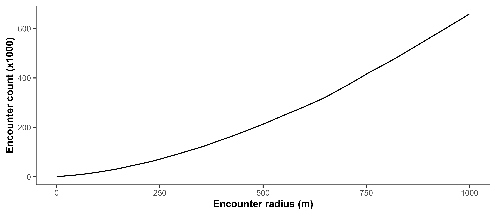
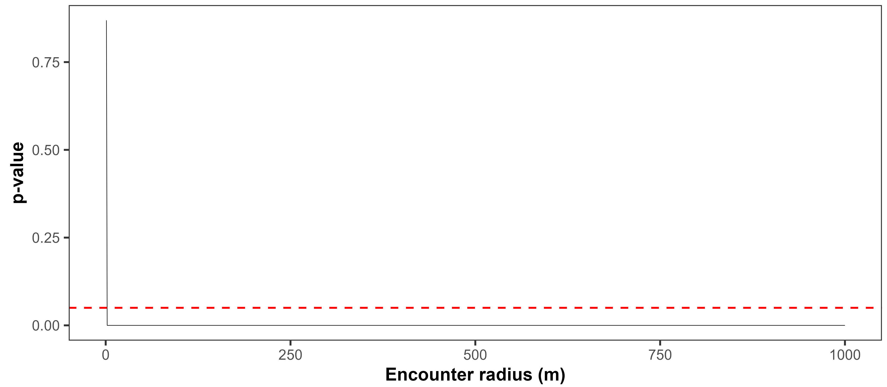
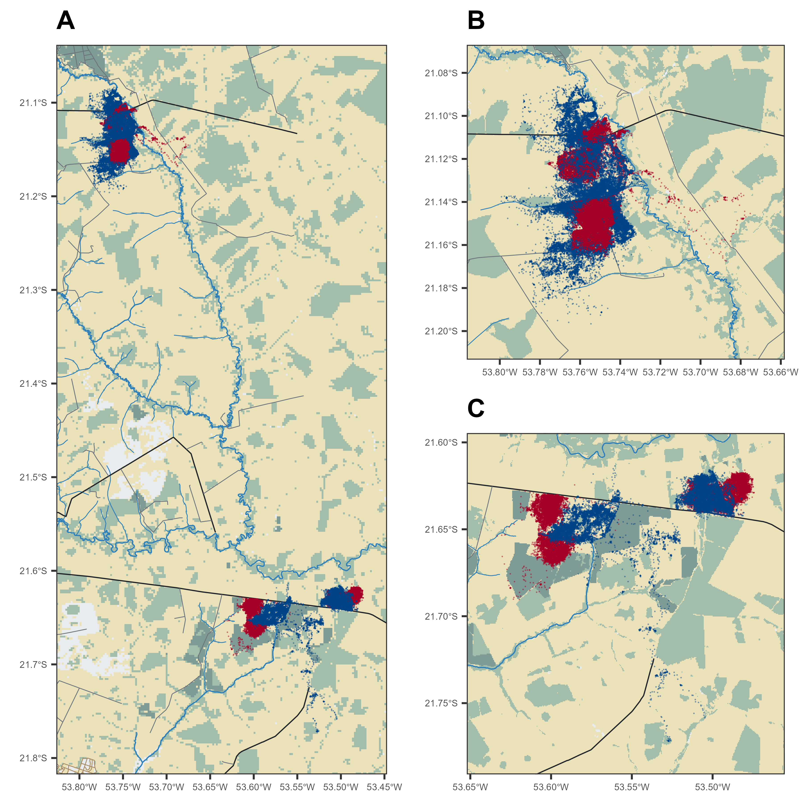
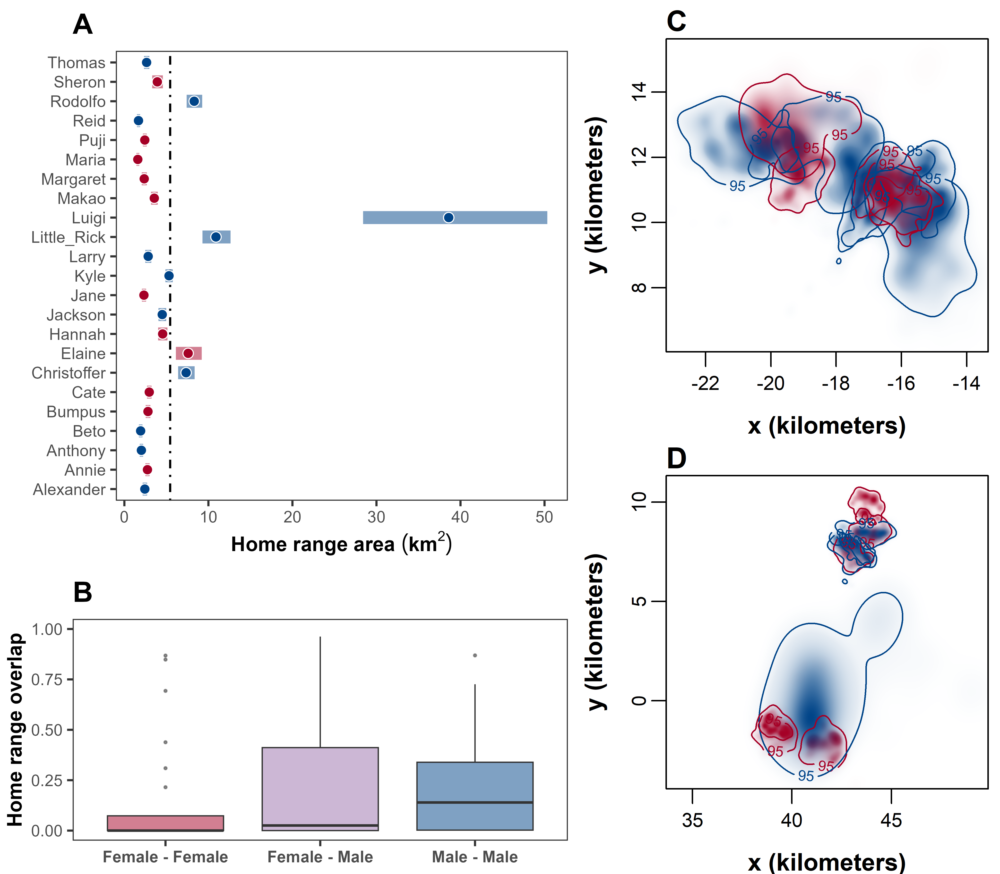
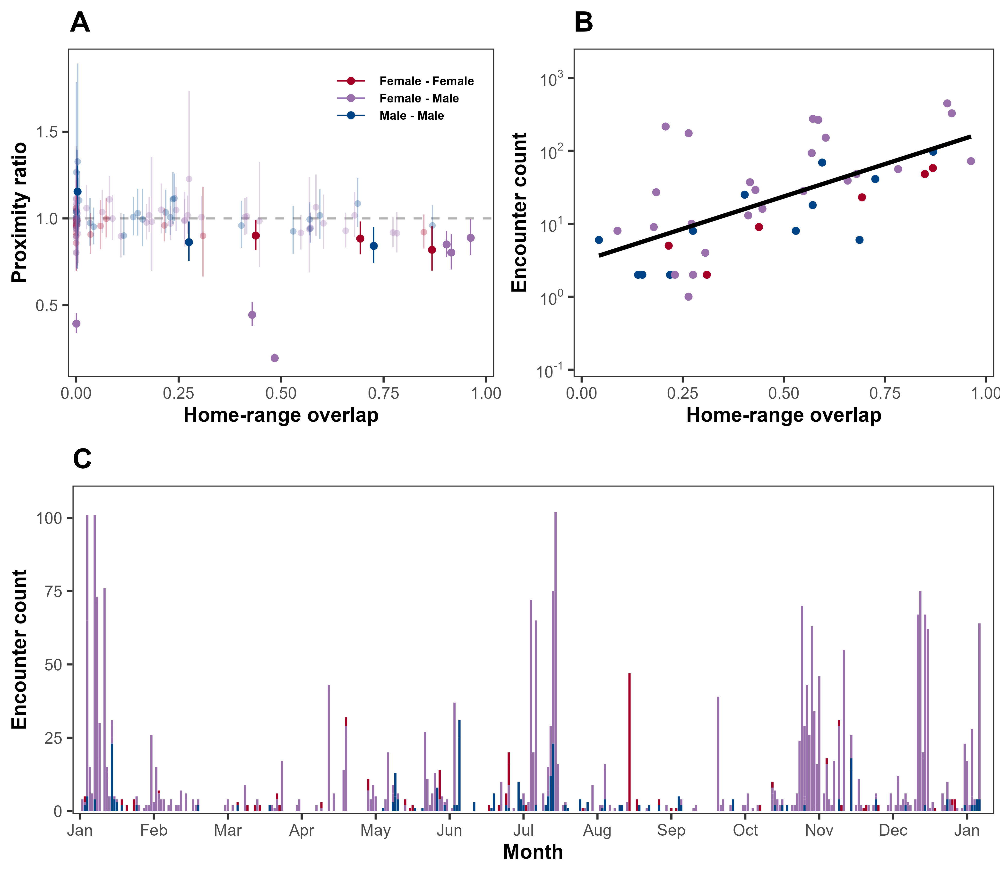
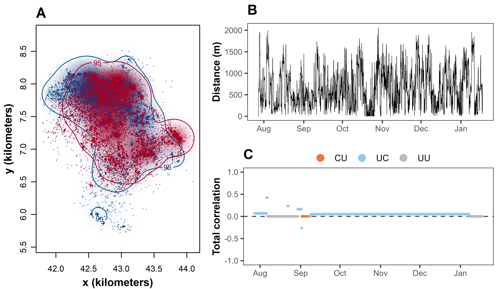

```{r setup, include=FALSE}
knitr::opts_chunk$set(echo = TRUE)
```

<hr style="border: 1px solid black;">

# **Overview**

Our primary aim was to understand the movement ecology of giant anteaters (*Myrmecophaga tridactyla*) at the social-spatial interface. Specifically, we aimed to address two overarching questions:

- Is the spatial arrangement of giant anteater home ranges governed by social factors (e.g., territoriality, mating groups, social groups, etc.)?
- Does giant anteater movement within their home range exhibit signs of social interactions (e.g., avoidance, attraction, correlated movement, etc.)?

In order to answer our two core research questions, we carried out three separate analyses focused on estimating patterns in: 

i) home-range overlap; 
ii) proximity and encounter rates; and 
iii) correlated movement. 

To do this, we used GPS data to quantify key socio-spatial patterns using the methods implemented in the `ctmm`  and the `corrMove` packages in `R`. In this appendix, we describe the workflow and specific steps that was used to carry out in each of these analyses below.

Data visualisation and analysis were carried out using R (version 4.2.2, R Core Team, 2022) and the following R packages: ctmm (version 1.1.0, Fleming & Calabrese, 2022), lme4 (version 1.1.31, Bates et al., 2015), glmmTMB (version 1.1.7, Brooks et al., 2017), corrMove (version 0.1.0, Calabrese & Fleming, 2023), and ggplot2 (version 3.4.2, Wickham, 2016). All R scripts can be found in the GitHub repository at https://github.com/QuantitativeEcologyLab/Giant_Anteater. 

<hr style="border: 1px solid black;">

# **Data**

Before analysis, we calibrated the GPS measurement error and removed any outlying data points (for full details on data pre-processing see Appendix S2 in (Noonan et al., 2022). First step of the analysis is to import the data and convert to a telemetry object for use in the ```ctmm``` package. 

```{r load-packages, message = FALSE}
#load packages
library(readr)
library(ggplot2)
library(dplyr)           
library(tidyr)    
library(tibble)
library(lubridate)       
library(gridExtra) 
library(egg)
library(scales)          
library(osmdata)         
library(terra)           
library(tidyterra)       
library(sf)              
library(ctmm)            
library(lme4)
library(glmmTMB)
library(corrMove)
```

```{r load-files, echo=FALSE}
#load data
load("data/anteater/anteater_data.rda")
load("data/anteater/bio_data.rda")
load("data/anteater/telemetry_data.rda")
#movement models and home range estimate
load("data/anteater_fit.rda")
load("data/anteater_akdes.rda")
#home range
load("data/home_range/HR_size.rda")
load("data/home_range/AKDE_1.rda")
load("data/home_range/AKDE_2.rda")
load("data/home_range/overlap_1_df.rda")
load("data/home_range/overlap_2_df.rda")
load("data/home_range/overlap_df.rda")
#encounters
load("data/encounter/proximity_df.rda")
load("data/encounter/distance_df.rda")
encounter_radius_df <- readRDS("data/encounter/encounter_radius_df.RDS")
load("data/encounter/proximity_identified_pairs_df.rda")
distance_pairs_df <- readRDS("data/encounter/distance_pairs_df.RDS")
#load correlated movement data
cm_pair1 <- readRDS("data/correlative_movement/cm_pair1.RDS")
cm_pair2 <- readRDS("data/correlative_movement/cm_pair2.RDS")
cm_pair3 <- readRDS("data/correlative_movement/cm_pair3.RDS")
cm_pair4 <- readRDS("data/correlative_movement/cm_pair4.RDS")
cm_pair5 <- readRDS("data/correlative_movement/cm_pair5.RDS")
cm_pair6 <- readRDS("data/correlative_movement/cm_pair6.RDS")
cm_pair7 <- readRDS("data/correlative_movement/cm_pair7.RDS")
cm_pair8 <- readRDS("data/correlative_movement/cm_pair8.RDS")
cm_pair9 <- readRDS("data/correlative_movement/cm_pair9.RDS")
cm_pair10 <- readRDS("data/correlative_movement/cm_pair10.RDS")
cm_pair11 <- readRDS("data/correlative_movement/cm_pair11.RDS")
cm_pair12 <- readRDS("data/correlative_movement/cm_pair12.RDS")
```


```{r import-data, message = FALSE}
#import data, cleaned giant anteater GPS tracking data, containing no outliers
DATA_GPS <- read.csv("data/anteater/Anteaters_NoOutliers.csv")

#import supplementary data containing biological information
DATA_META <- read.csv("data/anteater/Anteater_Results_Final.csv")

#correct mismatch ID entries
DATA_GPS$ID[DATA_GPS$ID == "Larry 267"] <- "Larry"
DATA_GPS$ID[DATA_GPS$ID == "Little Rick"] <- "Little_Rick"

#correct mismatch ID entries
DATA_META$ID[DATA_META$ID == "Little Rick"] <- "Little_Rick"
```

While a total of 43 individuals were collared as part of the larger monitoring effort (Noonan et al., 2022), here we restricted our analyses to 23 range-resident individuals living in three separate clusters. These individuals were selected as they resided in areas where there was high confidence that all resident giant anteaters were equipped with GPS trackers. The resulting dataset consisted of 528,324 GPS fixes.

```{r import-meta, message = FALSE}
#subset to the 23 range-resident individuals
anteater_data <- DATA_GPS[which(DATA_GPS$ID %in% c("Alexander", "Annie", "Anthony", "Beto", "Bumpus",
                                            "Cate", "Christoffer","Elaine", "Hannah","Jackson",
                                            "Jane","Kyle", "Larry", "Little_Rick", "Luigi",
                                            "Makao", "Margaret", "Maria", "Puji", "Reid", 
                                            "Rodolfo", "Sheron", "Thomas")),]

#subset to the 23 range-resident individuals
bio_data <- DATA_META[c(1:3,8:10,12,14,17,19,20,22,23,25:29,33:35,37,38),]
#subset the biological data
bio_data <- bio_data[,c(1:3,5)]

#add site location to the dataframe
bio_data$Site <- NA
bio_data$Site[bio_data$Road == "MS-040"] <- 1
bio_data$Site[bio_data$Road == "BR_267"] <- 2
bio_data

#convert GPS dataset to a telemetry object
DATA_TELEMETRY <- as.telemetry(anteater_data)

#summary of the dataset
summary(DATA_TELEMETRY)

#visualisation of the data
plot(DATA_TELEMETRY)
```

```{r eval = FALSE, echo=FALSE}
#save GPS dataframe
save(anteater_data, file = "data/anteater/anteater_data.rda")
#save biological information dataframe
save(bio_data, file = "data/anteater/bio_data.rda")
#save telemetry data
save(DATA_TELEMETRY, file = "data/anteater/telemetry_data.rda")
```

<hr style="border: 1px solid black;">

# **Movement Models**

After preparing the data, we fit the continuous-time movement models following the workflow described in Calabrese et al. (2016). 

```{r eval = FALSE}
#fit movement models
GUESS <- lapply(DATA_TELEMETRY[1:23], function(b) ctmm.guess(b,interactive=FALSE))
FIT <- lapply(1:23, function(i) ctmm.select(DATA_TELEMETRY[[i]],GUESS[[i]]))
names(FIT) <- names(DATA_TELEMETRY[1:23])
overlap(FIT)
```

```{r}
#summary of the fitted model
summary(FIT)
```

```{r eval = FALSE, echo=FALSE}
#save movement model
save(FIT, file = "data/anteater_fit.rda")
```

<hr style="border: 1px solid black;">

# **Home-Range Overlap**

## Estimating home-range areas

We estimated giant anteater home ranges using Autocorrelated Kernel Density Estimation (AKDE; Fleming et al., 2015) using the ```ctmm``` package. AKDE, corrects for autocorrelation induced bias (Noonan et al., 2019) by conditioning the bandwidth optimisation on the data’s autocorrelation structure (Fleming & Calabrese, 2017). Thus, home-range estimation first required fitting a series of continuous-time movement models to the GPS tracking data and identifying the best model via small sample-sized corrected Akaike’s Information Criterion (AICc) (Fleming & Calabrese, 2022). Giant anteater home ranges were then estimated conditional on each individual’s best-fit movement model.

```{r eval = FALSE}
#calculate AKDE home-range estimates based on the best fit model, create aligned UDs
AKDE <- akde(DATA_TELEMETRY[1:23],FIT)
overlap(AKDE)

```

```{r eval=FALSE, echo=FALSE}
#save AKDE home-range estimations
save(AKDE, file = "data/anteater_akdes.rda")
```

## Home-range results

```{r}
meta(AKDE)
```

```{r extract-hr,eval=FALSE,echo=FALSE}
#create a dataframe to store home range area statistics from the AKDE
HR_size <- data.frame()

#loop through each object in the AKDE list
for (i in 1:length(AKDE)) {
  #extract the home range area statistics summary
  summary <- summary(AKDE[[i]])$CI
  
  #bind the summary to the dataframe
  HR_size <- rbind(HR_size, as.data.frame(summary))
}

row.names(HR_size) <- NULL

#add biological data to dataframe
HR_size <- cbind(HR_size, bio_df)
HR_size <- relocate(HR_size, c(low, est, high), .after = Site)
names(HR_size)[6] <- "HR_low"
names(HR_size)[7] <- "HR_est"
names(HR_size)[8] <- "HR_high"

save(HR_size, file = "data/home_range/HR_size.rda")

```


```{r}
#calculate the mean total home range size
round(mean(HR_size$HR_est), 2)

#calculate CIs of the mean total home range size
round(mean(HR_size$HR_low), 2)
round(mean(HR_size$HR_high), 2)
```

Here, we calculate the home-range statistics based on a sex parameter using the `ctmm` function `meta()`.

```{r hr-sex-analysis}
#Does home-range size differ between sexes?

#subset each individual based on their sex
AKDE_male <- AKDE[c("Alexander", "Anthony", "Beto","Christoffer","Jackson",
                    "Kyle", "Larry", "Little_Rick", "Luigi", "Reid", 
                    "Rodolfo", "Thomas")]
AKDE_female <- AKDE[c("Annie", "Bumpus", "Cate", "Elaine", "Hannah",
                      "Jane","Makao", "Margaret", "Maria", "Puji",
                      "Sheron")]

#calculate mean home range sizes for male
meta(AKDE_male)

#calculate mean home range sizes for female
meta(AKDE_female)

#test to see significance of sex on home range
AKDE_sex_compare <- list(male = AKDE_male,
                         female = AKDE_female)
COL_sex <- c("#004488", "#A50026")
meta(AKDE_sex_compare, col = COL_sex, sort = TRUE)
```

We investigated if weight was a factor in home-range size. We used a GLMM with a gamma distribution, a log link function, and site as a random effect to determine whether the weight differed between individuals. This model was then compared to similar model that excluded the weight predictor variable using a likelihood ratio test.


```{r hr-weight}
#import supplementary data containing biological information
DATA_META <- read.csv("data/anteater/Anteater_Results_Final.csv")
#subset biological data from supplementary data
bio_data <- DATA_META[c(1:3,8:10,12,14,17,19,20,22,23,25:29,33:35,37,38), c(1:5)]
#add site location 
bio_data$Site[bio_data$Road == "MS-040"] <- 1
bio_data$Site[bio_data$Road == "BR_267"] <- 2

#load home range size data
load("data/home_range/HR_size.rda")
Weight <- bio_data[,4]
HR_size <- cbind(HR_size, Weight)

#without luigi
HR_size <- HR_size[HR_size$ID != "Luigi",]

#............................................................
# Is weight a factor in home-range size?

#compare model with and without weight as a variable
HR_weight_test <- glmmTMB(HR_est ~ Weight + (1|Site), 
                          family = Gamma(link = "log"), data = HR_size)
HR_weight_test2 <- glmmTMB(HR_est ~ 1 + (1|Site), 
                           family = Gamma(link = "log"), data = HR_size)

HR_weight_test_results <- anova(HR_weight_test, HR_weight_test2)
HR_weight_test_results

#calculate weight impact via likelihood ratio test
HR_weight_test_pvalue <- round(HR_weight_test_results$`Pr(>Chisq)`[2], 2)
HR_weight_test_pvalue

summary(HR_weight_test)

plot(HR_size$HR_est ~ HR_size$Weight)

summary(HR_weight_test)
```

---

## Estimating home-range overlap

Home-range overlap was estimated for all pairs of individuals (i.e., dyads) via the Bhattacharyya coefficient (Winner et al., 2018). 

```{r}
#subset home-range overlap based on the site location
AKDE_1 <- AKDE[c("Alexander", "Anthony", "Bumpus", "Cate", "Christoffer",
                 "Elaine", "Jackson", "Kyle", "Little_Rick", "Makao",
                 "Puji", "Rodolfo")]

AKDE_2 <- AKDE[c("Annie", "Beto", "Hannah", "Jane", "Larry",
                 "Luigi", "Margaret", "Maria", "Reid", "Sheron",
                 "Thomas")]
```

```{r eval=FALSE, echo=FALSE}
#save home range estimates for each site
save(AKDE_1, file = "data/home_range/AKDE_1.rda")
save(AKDE_2, file = "data/home_range/AKDE_2.rda")
```


```{r overlap}
#calculate 95% AKDE home-range overlap for a pairwise comparison for each site
overlap_1 <- overlap(AKDE_1, level = 0.95)
overlap_2 <- overlap(AKDE_2, level = 0.95)
```

```{r eval = FALSE}
#create a pairwise dataframe by pairing up every individual at each site

#extract CI 'est' matrix from array
overlap_1_est <- overlap_1$CI[ , , 2]
#remove duplicate values of the matrix
overlap_1_est[upper.tri(overlap_1_est, diag = TRUE)] <- NA
#Create a new data frame based on the overlap values
overlap_1_df <- as.data.frame(overlap_1_est)
overlap_1_df$anteater_A <- rownames(overlap_1_df)
overlap_1_df <- pivot_longer(overlap_1_df, cols = -anteater_A, 
                             names_to = 'anteater_B', values_to = 'overlap_est', values_drop_na = TRUE)

#extract CI 'low' matrix from array
overlap_1_low <- overlap_1$CI[ , , 1]
#remove duplicate values of the matrix
overlap_1_low[upper.tri(overlap_1_low, diag = TRUE)] <- NA
#create a new dataframe based on the overlap values
overlap_1_low <- as.data.frame(overlap_1_low)
overlap_1_low$anteater_A <- rownames(overlap_1_low)
overlap_1_low <- pivot_longer(overlap_1_low, cols = -anteater_A, 
                              names_to = 'anteater_B', values_to = 'overlap_low',
                              values_drop_na = TRUE)
overlap_1_df <- left_join(overlap_1_df, overlap_1_low, 
                          by = c("anteater_A", "anteater_B"))
overlap_1_df <- relocate(overlap_1_df, overlap_low, .before = overlap_est)

#extract CI 'high' matrix from array
overlap_1_high <- overlap_1$CI[ , , 3]
#remove duplicate values of the matrix
overlap_1_high[upper.tri(overlap_1_high, diag = TRUE)] <- NA
#create a new dataframe based on the overlap values
overlap_1_high <- as.data.frame(overlap_1_high)
overlap_1_high$anteater_A <- rownames(overlap_1_high)
overlap_1_high <- pivot_longer(overlap_1_high, cols = -anteater_A, 
                               names_to = 'anteater_B', values_to = 'overlap_high',
                               values_drop_na = TRUE)
overlap_1_df <- left_join(overlap_1_df, overlap_1_high, 
                          by = c("anteater_A", "anteater_B"))

#add biological data to dataframe
overlap_1_df <- left_join(overlap_1_df, rename(bio_data, anteater_A = ID), 
                          by = "anteater_A")
overlap_1_df <- left_join(overlap_1_df, rename(bio_data, anteater_B = ID), 
                          by = "anteater_B", suffix = c(".A", ".B"))
#add column to indicate which sexes that are being compared
overlap_1_df <- mutate(overlap_1_df,
                       sex_comparison = 
                         case_when(paste(Sex.A, Sex.B) == "Male Male" ~ "male-male",
                                   paste(Sex.A, Sex.B) == "Female Female" ~ "female-female",
                                   paste(Sex.A, Sex.B) == "Male Female" ~ "female-male",
                                   paste(Sex.A, Sex.B) == "Female Male" ~ "female-male"))
#assign site
overlap_1_df$site <- 1
overlap_1_df <- relocate(overlap_1_df, 
                         c("overlap_low", "overlap_est", "overlap_high"), .after = site)
```

```{r eval = FALSE}
#extract CI 'est' matrix from array
overlap_2_est <- overlap_2$CI[ , , 2]
#remove duplicate values of the matrix
overlap_2_est[upper.tri(overlap_2_est, diag = TRUE)] <- NA
#create a new data frame based on the overlap values
overlap_2_df <- as.data.frame(overlap_2_est)
overlap_2_df$anteater_A <- rownames(overlap_2_df)
overlap_2_df <- pivot_longer(overlap_2_df, cols = -anteater_A, 
                             names_to = 'anteater_B', values_to = 'overlap_est', values_drop_na = TRUE)

#extract CI 'low' matrix from array
overlap_2_low <- overlap_2$CI[ , , 1]
#remove duplicate values of the matrix
overlap_2_low[upper.tri(overlap_2_low, diag = TRUE)] <- NA
#create a new data frame based on the overlap values
overlap_2_low <- as.data.frame(overlap_2_low)
overlap_2_low$anteater_A <- rownames(overlap_2_low)
overlap_2_low <- pivot_longer(overlap_2_low, cols = -anteater_A, 
                              names_to = 'anteater_B', values_to = 'overlap_low',
                              values_drop_na = TRUE)
overlap_2_df <- left_join(overlap_2_df, overlap_2_low, 
                          by = c("anteater_A", "anteater_B"))
overlap_2_df <- relocate(overlap_2_df, overlap_low, .before = overlap_est)

#extract CI 'high' matrix from array
overlap_2_high <- overlap_2$CI[ , , 3]
#remove duplicate values of the matrix
overlap_2_high[upper.tri(overlap_2_high, diag = TRUE)] <- NA
#create a new data frame based on the overlap values
overlap_2_high <- as.data.frame(overlap_2_high)
overlap_2_high$anteater_A <- rownames(overlap_2_high)
overlap_2_high <- pivot_longer(overlap_2_high, cols = -anteater_A, 
                               names_to = 'anteater_B', values_to = 'overlap_high',
                               values_drop_na = TRUE)
overlap_2_df <- left_join(overlap_2_df, overlap_2_high, 
                          by = c("anteater_A", "anteater_B"))

#add biological data to dataframe
overlap_2_df <- left_join(overlap_2_df, rename(bio_data, anteater_A = ID), 
                          by = "anteater_A")
overlap_2_df <- left_join(overlap_2_df, rename(bio_data, anteater_B = ID), 
                          by = "anteater_B", suffix = c(".A", ".B"))
#add column to indicate which sexes that are being compared
overlap_2_df <- mutate(overlap_2_df,
                       sex_comparison = 
                         case_when(paste(Sex.A, Sex.B) == "Male Male" ~ "male-male",
                                   paste(Sex.A, Sex.B) == "Female Female" ~ "female-female",
                                   paste(Sex.A, Sex.B) == "Male Female" ~ "female-male",
                                   paste(Sex.A, Sex.B) == "Female Male" ~ "female-male"))
#assign site
overlap_2_df$site <- 2
overlap_2_df <- relocate(overlap_2_df, 
                         c("overlap_low", "overlap_est", "overlap_high"), .after = site)
```

```{r eval = FALSE}
#combine both sites into one dataframe
overlap_df <- rbind(overlap_1_df, overlap_2_df)
overlap_df$pair_ID <- paste(overlap_df$anteater_A, overlap_df$anteater_B, sep = "_")
overlap_df <- relocate(overlap_df, pair_ID, .before = anteater_A)

#clean up environment
rm(overlap_1_low, overlap_1_est, overlap_1_high,
   overlap_2_low, overlap_2_est, overlap_2_high)
```

```{r eval = FALSE, echo=FALSE}
#save home range overlap dataframes
save(object = overlap_1_df, file = "data/home_range/overlap_1_df.rda")
save(object = overlap_2_df, file = "data/home_range/overlap_2_df.rda")
save(object = overlap_df, file = "data/home_range/overlap_df.rda")
```

## Home-range overlap results

```{r}
#calculate mean total home-range overlap 
round(mean(overlap_df$overlap_est), 2)

#calculate range of total home-range overlap 
round(min(overlap_df$overlap_est), 2)
round(max(overlap_df$overlap_est), 2)
```

To determine if sex was a factor underpinning the degree of pairwise overlap, we fit a Generalized Linear Mixed Model (GLMM) with a beta distribution and a logit link function to the home-range overlap estimates, with pairwise sex as a predictor variable (i.e., male-male, female-female, and female-male). In addition, site was included as a random effect. Because the overlap values ranged between [0,1], we rescaled the values as (y(n-1) + 0.5)/n in order for them to lie within the (0,1) interval (Smithson & Verkuilen, 2006). This model was then compared to a similar model that excluded the pairwise sex predictor variable using a likelihood ratio test.

```{r}
#rescale the values
min_val <- min(overlap_df$overlap_est)
max_val <- max(overlap_df$overlap_est)
squeeze_min <- 0.001
squeeze_max <- 0.999
overlap_df$overlap_est_squeezed <- ((overlap_df$overlap_est - min_val) / (max_val - min_val)) * (squeeze_max - squeeze_min) + squeeze_min
overlap_df <- relocate(overlap_df, overlap_est_squeezed, .after = overlap_high)

#test for significance in sex, compare model with and without sex as a variable
HRO_test <- glmmTMB(overlap_est_squeezed ~ sex_comparison + (1|site), 
                    family = beta_family(link = "logit"), data = overlap_df)
HRO_test2 <- glmmTMB(overlap_est_squeezed ~ 1 + (1|site), 
                     family = beta_family(link = "logit"), data = overlap_df)
HRO_test_results <- anova(HRO_test, HRO_test2)
HRO_test_results
HRO_test_pvalue <- round(HRO_test_results$`Pr(>Chisq)`[2], 2)
HRO_test_pvalue
```

Home-range overlap results based on sex comparisons (i.e.. male-male, female-female, and female-male).

```{r}
#number of home-range overlap in each sex comparison category
table(overlap_df$sex_comparison)

#calculate mean home-range overlap and the range based on sex comparisons
round(mean(overlap_df$overlap_est[overlap_df$sex_comparison == "male-male"]), 2)
round(min(overlap_df$overlap_est[overlap_df$sex_comparison == "male-male"]), 2)
round(max(overlap_df$overlap_est[overlap_df$sex_comparison == "male-male"]), 2)

round(mean(overlap_df$overlap_est[overlap_df$sex_comparison == "female-female"]), 2)
round(min(overlap_df$overlap_est[overlap_df$sex_comparison == "female-female"]), 2)
round(max(overlap_df$overlap_est[overlap_df$sex_comparison == "female-female"]), 2)

round(mean(overlap_df$overlap_est[overlap_df$sex_comparison == "female-male"]), 2)
round(min(overlap_df$overlap_est[overlap_df$sex_comparison == "female-male"]), 2)
round(max(overlap_df$overlap_est[overlap_df$sex_comparison == "female-male"]), 2)
```

<hr style="border: 1px solid black;">

# **Proximity and Encounters**

While home-range overlap describes patterns in spatial structuring, it does not directly indicate whether individuals are likely to be in the same place at the same time (Winner et al., 2018). In order to understand the temporal component of giant anteaters’ socio-spatial behaviour, we estimated a proximity ratio for all dyads via the `ctmm` function `proximity()`. 

## Proximity

### Estimating proximity ratio

The proximity ratio was estimated by comparing a dyad’s observed separation distances with the separation distances expected under completely random movement. A proximity ratio of 1 is thus consistent with independent movement, values <1 indicate that the two individuals are closer on average than expected for independent movement, and vice versa for values >1. 

```{r}
#subset movement models of individuals based on their site location
FIT_1 <- FIT[c("Alexander", "Anthony", "Bumpus", "Cate", "Christoffer",
               "Elaine", "Jackson", "Kyle", "Little_Rick", "Makao",
               "Puji", "Rodolfo")]
FIT_2 <- FIT[c("Annie", "Beto", "Hannah", "Jane", "Larry",
               "Luigi", "Margaret", "Maria", "Reid", "Sheron",
               "Thomas")]
```

```{r eval = FALSE}
#create empty columns for the results to be saved to
overlap_1_df$proximity_low <- NA
overlap_1_df$proximity_est <- NA
overlap_1_df$proximity_high <- NA

#calculate the proximity statistics
for(i in 1:nrow(overlap_1)){
  ANIMAL_A <- as.character(overlap_1_df[i, 'anteater_A'])
  ANIMAL_B <- as.character(overlap_1_df[i, 'anteater_B'])
  
  TRACKING_DATA.1 <- DATA_TELEMETRY[c(ANIMAL_A, ANIMAL_B)]
  MODELS.1 <- list(FIT_1[ANIMAL_A][[1]], FIT_1[ANIMAL_B][[1]])
  
  PROXIMITY1 <- tryCatch(
    {
      #calculate the proximity statistic
      PROXIMITY_1 <- proximity(data = TRACKING_DATA.1, CTMM = MODELS.1, GUESS=ctmm(error=FALSE))},
    error=function(err){
      PROXIMITY_1 <- c(NA,NA,NA)
      return(PROXIMITY_1)
    }
  )
  
  overlap_1_df[i, c("proximity_low")] <- PROXIMITY_1[1]
  overlap_1_df[i, c("proximity_est")] <- PROXIMITY_1[2]
  overlap_1_df[i, c("proximity_high")] <- PROXIMITY_1[3]
  
  #save results to a csv file
  write.csv(overlap_1_df, "data/encounter/DATA_proximity_1.csv", row.names = FALSE)
  #track progress
  cat("finished index", i, "\n")
}
```

```{r eval = FALSE}
#create empty columns for the results to be saved to
overlap_2_df$proximity_low <- NA
overlap_2_df$proximity_est <- NA
overlap_2_df$proximity_high <- NA

#calculate the proximity statistics
for(i in 1:nrow(overlap_2_df)){
  ANIMAL_A <- as.character(overlap_2_df[i, 'anteater_A'])
  ANIMAL_B <- as.character(overlap_2_df[i, 'anteater_B'])
  
  TRACKING_DATA_2 <- DATA_TELEMETRY[c(ANIMAL_A, ANIMAL_B)] 
  MODELS_2 <- list(FIT_2[ANIMAL_A][[1]], FIT_2[ANIMAL_B][[1]])
  
  PROXIMITY_2 <- tryCatch(
    {
      #calculate the proximity statistic
      PROXIMITY_2 <- proximity(data = TRACKING_DATA_2, 
                               CTMM = MODELS_2, 
                               GUESS=ctmm(error=FALSE))},
    error=function(err){
      PROXIMITY_2 <- c(NA,NA,NA)
      return(PROXIMITY_2)
    }
  )
  overlap_2_df[i, c("proximity_low")] <- PROXIMITY_2[1]
  overlap_2_df[i, c("proximity_est")] <- PROXIMITY_2[2]
  overlap_2_df[i, c("proximity_high")] <- PROXIMITY_2[3]
  
  #save results in a csv file
  write.csv(overlap_2_df, "data/enocunter/DATA_proximity_2.csv", row.names = FALSE)
  #track progress
  cat("finished index", i, "\n")
}
```

```{r eval = FALSE, message = FALSE}
#import proximity statistics data
DATA_proximity_1 <- read.csv("data/encounter/DATA_proximity_1.csv")
DATA_proximity_2 <- read.csv("data/encounter/DATA_proximity_2.csv")

#correct mismatch entry
DATA_proximity_1$anteater_A[DATA_proximity_1$anteater_A == "Little Rick"] <- "Little_Rick"
DATA_proximity_1$anteater_B[DATA_proximity_1$anteater_B == "Little Rick"] <- "Little_Rick"
DATA_proximity_2$anteater_A[DATA_proximity_2$anteater_A == "Larry 267"] <- "Larry"
DATA_proximity_2$anteater_B[DATA_proximity_2$anteater_B == "Larry 267"] <- "Larry"

#add missing site column to dataframe for site 2
DATA_proximity_2$site <- 2
DATA_proximity_2 <- relocate(DATA_proximity_2, site, .before = proximity_low)

#create a proximity dataframe
proximity_df <- bind_rows(DATA_proximity_1, DATA_proximity_2)
proximity_df <- proximity_df[,-3]
proximity_df <- mutate(proximity_df,
                       sex_comparison = 
                         case_when(paste(Sex.A, Sex.B) == "Male Male" ~ "male-male",
                                   paste(Sex.A, Sex.B) == "Female Female" ~ "female-female",
                                   paste(Sex.A, Sex.B) == "Male Female" ~ "female-male",
                                   paste(Sex.A, Sex.B) == "Female Male" ~ "female-male"))

#add home-range overlap data to proximity dataframe
proximity_df <- left_join(overlap_df, proximity_df, by = c("anteater_A", "anteater_B",
                                                           "Sex.A", "Sex.B",
                                                           "Age.A", "Age.B",
                                                           "sex_comparison",
                                                           "site"))

```

```{r eval = FALSE, echo=FALSE}
#save proximity dataframe
save(proximity_df, file = "data/encounter/proximity_df.rda")
```

### Proximity ratio results

We used a GLMM with a gamma distribution, a log link function, and site as a random effect to determine whether the estimated proximity ratios differed between pairwise sex combinations. This model was then compared to similar model that excluded the pairwise sex predictor variable using a likelihood ratio test.

```{r proximity-analysis}
#test for significance in sex, compare model with and without sex as a variable
proximity_test <- glmer(proximity_est ~ sex_comparison + (1|site), 
                        family = Gamma(link = "log"), data = proximity_df)
proximity_test2 <- glmer(proximity_est ~ 1 + (1|site), 
                         family = Gamma(link = "log"), data = proximity_df)
proximity_test_results <- anova(proximity_test, proximity_test2)
proximity_test_results
proximity_test_pvalue <- round(proximity_test_results$`Pr(>Chisq)`[2], 2)
proximity_test_pvalue

#test for significance in home-range overlap, compare model with and without overlap as a variable
prox_overlap_test <- glmer(proximity_est ~ overlap_est + (1|site), 
                           family = Gamma(link = "log"), data = proximity_df)
prox_overlap_test2 <- glmer(proximity_est ~ 1 + (1|site), 
                            family = Gamma(link = "log"), data = proximity_df)
prox_overlap_test_results <- anova(prox_overlap_test, prox_overlap_test2)
prox_overlap_test_results
prox_overlap_test_pvalue <- round(prox_overlap_test_results$`Pr(>Chisq)`[2], 2)
prox_overlap_test_pvalue
```

---

## Encounters

In order to calculate the number of encounter events, we needed to estimate the Euclidean distance between the individuals in each dyads at each timepoint using the `ctmm` function `distances()`. From these separation distances we estimated the number of encounter events for each dyad using a 15m distance threshold. We also performed a sensitivity analysis on the 15m threshold. 

### Estimating distance

```{r distance, eval = FALSE}
#create empty columns for the results to be saved to
proximity_df$distance_low <- NA
proximity_df$distance_est <- NA
proximity_df$distance_high <- NA
#create empty list for the results to be saved to
RES <- list()

#calculate the distance statistics
for (i in 1:nrow(overlap_df)) {
  ANIMAL_A <- as.character(overlap_df[i, 'anteater_A']) 
  ANIMAL_B <- as.character(overlap_df[i, 'anteater_B'])
  TRACKING_DATA <- DATA_TELEMETRY[c(ANIMAL_A, ANIMAL_B)]
  MODELS <- list(FIT[[ANIMAL_A]], FIT[[ANIMAL_B]])
  
  DISTANCES_RES <- tryCatch({
    distances_result <- distances(data = TRACKING_DATA, 
                                  CTMM = MODELS, 
                                  GUESS = ctmm(error = FALSE))
    data.frame(pair_ID = paste(ANIMAL_A, ANIMAL_B, sep = "_"),
               distance_low = distances_result$low, 
               distance_est = distances_result$est, 
               distance_high = distances_result$high,
               t = distances_result$t,
               timestamp = distances_result$timestamp)
  }, error = function(err) {
    data.frame(pair_ID = paste(ANIMAL_A, ANIMAL_B, sep = "_"),
               distance_low = NA,
               distance_est = NA,
               distance_high = NA,
               t = NA, 
               timestamp = NA)
  })
  
  RES[[i]] <- DISTANCES_RES
  
  #track progress
  cat("finished index", i, "\n")
}

#turn the list of list into a dataframe
DATA_DISTANCE <- do.call(rbind, RES)

```

```{r eval = FALSE, echo=FALSE}
#save distance data
saveRDS(DATA_DISTANCE, file = "data/encounter/DATA_DISTANCE.rds")
```

```{r eval = FALSE}
#import the distance statistics data
DATA_DISTANCE <- readRDS("data/encounter/DATA_DISTANCE.rds")

#locate NA values within the dataframe
DATA_DISTANCE[!complete.cases(DATA_DISTANCE), ]
#drop the 3 fixes that had no distance values 
DATA_DISTANCE <- na.omit(DATA_DISTANCE)

#add overlap and proximity information to the distance dataframe
distance_df <- merge(DATA_DISTANCE, proximity_df, by = "pair_ID")
distance_df <- relocate(distance_df, c(distance_low, distance_est, distance_high,
                                       t, timestamp), .after = proximity_high)
```

```{r eval = FALSE, echo=FALSE}
#save the distance dataframe
save(distance_df, file = "data/encounter/distance_df.rda")
```

### Sensitivity analysis

```{r}
#set encounter radius
enc_radius <- 0:1000
enc_count <- vector("numeric", length(enc_radius))

#calculate the number of encounters occurring within each radius size
for(i in 1:length(enc_radius)){
  enc_count[i] <- sum(distance_df$distance_est < enc_radius[i])
}
```

```{r eval=FALSE}
plot_enc_radius_count <- 
  ggplot() +
  geom_line(aes(x = enc_radius, y = enc_count)) +
  labs(x = "Encounter radius (m)", 
       y = "Encounter count (x1000)") +
  scale_y_continuous(labels = function(enc_count) enc_count / 1000) +
  theme_bw() +
  theme(panel.grid.major = element_blank(),
        panel.grid.minor = element_blank(),
        plot.title = element_text( size = 14, family = "sans", face = "bold"),
        axis.title.y = element_text(size=10, family = "sans", face = "bold"),
        axis.title.x = element_text(size=10, family = "sans", face = "bold"),
        axis.text.y = element_text(size=8, family = "sans"),
        axis.text.x  = element_text(size=8, family = "sans"),
        legend.position="none",
        panel.background = element_rect(fill = "transparent"),
        legend.background = element_rect(fill = "transparent"),
        plot.background = element_rect(fill = "transparent", color = NA),
        plot.margin = unit(c(0.2,0.1,0.2,0.2), "cm"))
```

```{r eval=FALSE, echo=FALSE}
ggsave(plot_enc_radius_count, 
       file = "figures/individual figures/enc_radius_count.png", 
       width = 6.86, height = 3, units = "in", dpi = 600, bg = "transparent")
```



```{r eval = FALSE, message=FALSE}
#sensitivity analysis on female-male encounter significance
#create empty columns for the results to be saved to
encounter_radius_pvalue <- vector("numeric", length(enc_radius))
pair_ID <- unique(overlap_df$pair_ID)

#loop over encounter radii
for(i in 1:length(enc_radius)){
  
  res <- list()
  
  for (j in pair_ID){
    subset_A <- distance_df[distance_df$pair_ID == j,]
    
    #count the number of times "distance_est" is below some threshold distance i 
    encounter_count <- sum(subset_A$distance_est < enc_radius[i])
    
    #save results
    res[[j]] <- data.frame(encounter_count = encounter_count,
                           overlap_est = subset_A$overlap_est[1],
                           sex_comparison = subset_A$sex_comparison[1],
                           site = subset_A$site[1])
    
  }
  
  res <- do.call(rbind, res)
  encounter_radius_test <- try(glmer(encounter_count ~ 
                                       overlap_est + sex_comparison + (1|site), 
                                     family = poisson(link = "log"), 
                                     data = res, subset = res > 0))
  encounter_radius_test2 <- try(glmer(encounter_count ~ 1 + (1|site), 
                                      family = poisson(link = "log"), 
                                      data = res, subset = res > 0))
  encounter_radius_test_results <- try(anova(encounter_radius_test, encounter_radius_test2))
  p_val <- try(encounter_radius_test_results$`Pr(>Chisq)`[2])
  encounter_radius_pvalue[i] <- ifelse(class(p_val) == "try-error", NA, p_val)
  
  #track progress
  cat("finished index", i, "\n")
}

#create an encounter radius dataframe
encounter_radius_df <- data.frame(x = enc_radius,
                                  y = encounter_radius_pvalue)

saveRDS(encounter_radius_df, file = "data/encounter/encounter_radius_df.RDS")

```

```{r eval=FALSE}
plot_enc_radius_pvalue <-
ggplot() +
  geom_line(data = encounter_radius_df, 
            aes(x = x, y = y),
            size = 0.15) +
  geom_hline(yintercept = 0.05, linetype = "dashed", color = "red") +
  xlab("Encounter radius (m)") +
  ylab("p-value") +
  theme_bw() +
  theme(panel.grid.major = element_blank(),
        panel.grid.minor = element_blank(),
        plot.title = element_text(size = 14, family = "sans", face = "bold"),
        axis.title.y = element_text(size=10, family = "sans", face = "bold"),
        axis.title.x = element_text(size=10, family = "sans", face = "bold"),
        axis.text.y = element_text(size=8, family = "sans"),
        axis.text.x = element_text(size=8, family = "sans"),
        panel.background = element_rect(fill = "transparent"),
        plot.background = element_rect(fill = "transparent", color = NA),
        plot.margin = unit(c(0.1,0.1,0.05,0.2), "cm")) #top, right, bot, left)
```

```{r eval=FALSE, echo=FALSE}
ggsave(plot_enc_radius_pvalue, 
       file = "figures/individual figures/enc_radius_pvalue.png", 
       width = 6.86, height = 3, units = "in", dpi = 600, bg = "transparent")
```



### Estimating encounters

```{r encounters}
#create an empty column for the results to be saved to
proximity_df$encounter_count <- NA
pair_ID <- unique(proximity_df$pair_ID)

#calculate total encounters of all individuals based on sex comparison type
for (i in pair_ID){
  subset_A <- distance_df[distance_df$pair_ID == i,]
  
  #count the number of times distance is below 15
  encounter_count <- sum(subset_A$distance_est < 15)
  
  #save results
  proximity_df[proximity_df$pair_ID == i, "encounter_count"] <- encounter_count
  
}

#number of pairs that had 0 encounters
proximity_df[proximity_df$encounter_count == 0,]
#number of pairs that had at least 1 encounter
proximity_df[proximity_df$encounter_count != 0,]

#calculate the number of encounters based on threshold of 15m
sum(proximity_df$encounter_count)
sum(proximity_df$encounter_count[proximity_df$sex_comparison == "male-male"])
sum(proximity_df$encounter_count[proximity_df$sex_comparison == "female-female"])
sum(proximity_df$encounter_count[proximity_df$sex_comparison == "female-male"])

```

### Encounter results

We used a GLMM with a Poisson distribution, a log link function, and site as a random effect to determine whether encounter rates differed between the pairwise sex combinations. This model was then compared to similar model that excluded the pairwise sex predictor variable using a likelihood ratio test. Additionally, we used a Hierarchical Generalized Additive Model (HGAM) with a Poisson distribution, a log link function, to test for any temporal trends in encounters.

```{r encounter-analysis}
#effect of sex and overlap on encounter rates and does not include 0 encounter counts
encounter_test <- glmer(encounter_count ~ overlap_est + sex_comparison + (1|site), 
                        family = poisson(link = "log"), 
                        data = proximity_df, subset = encounter_count > 0)
encounter_test2 <- glmer(encounter_count ~ 1 + (1|site), 
                         family = poisson(link = "log"), 
                         data = proximity_df, subset = encounter_count > 0)
encounter_test_results <- anova(encounter_test, encounter_test2)
encounter_test_results
encounter_test_pvalue <- round(encounter_test_results$`Pr(>Chisq)`[2], 2)
encounter_test_pvalue

#amount of home-range overlap and the number of observed encounters
summary(encounter_test)
```

<hr style="border: 1px solid black;">

# **Correlated Movement**

To evaluate if pairs of giant anteaters exhibited any correlation in their movement, all dyads with a proximity ratio that differed significantly from 1 (based on the 95% confidence interval) were identified and carried forward to our subsequent, correlated movement analysis. 

## Exploring deviations in proximity ratios

```{r eval = FALSE}
#identify pairs that did not have a proximity ratio of 1
proximity_above1 <- proximity_df[proximity_df$proximity_low > 1,]
proximity_below1 <- proximity_df[proximity_df$proximity_high < 1,]

#exclude pairs with a HR overlap of 0
proximity_below1[proximity_below1$overlap_est < 0.0001,]
proximity_below1 <- proximity_below1[!(proximity_below1$overlap_est < 0.0001),]

#create a dataframe of the deviated pairs
proximity_identified_pairs_df <- rbind(proximity_above1, proximity_below1)
proximity_identified_pairs_df$pair_ID_number <- seq(from = 1, to = 12, by = 1)
proximity_identified_pairs_df <- relocate(proximity_identified_pairs_df, pair_ID_number, .before = anteater_A)

#correct the sex_comparison output to female-male
proximity_identified_pairs_df <- mutate(proximity_identified_pairs_df, sex_comparison = 
                                          case_when(paste(Sex.A, Sex.B) == "Male Male" ~ "male-male",
                                                    paste(Sex.A, Sex.B) == "Female Female" ~ "female-female",
                                                    paste(Sex.A, Sex.B) == "Male Female" ~ "female-male",
                                                    paste(Sex.A, Sex.B) == "Female Male" ~ "female-male"))

#clean up environment
rm(proximity_above1, proximity_below1)

```

```{r eval=FALSE, echo=FALSE}
#save deviated pairs dataframe
save(proximity_identified_pairs_df, file = "data/encounter/proximity_identified_pairs_df.rda")
```

## Deviated pairs results

```{r prox-pair-analysis}
#number of pairs with a deviated proximity ratio based on sex comparison
table(proximity_identified_pairs_df$sex_comparison)

#test for significance in sex, compare model with and without sex as a variable
proximity_test_pairs <- glmer(proximity_est ~ sex_comparison + (1|site), 
                              family = Gamma(link = "log"), 
                              data = proximity_identified_pairs_df)
proximity_test2_pairs <- glmer(proximity_est ~ 1 + (1|site), 
                               family = Gamma(link = "log"), 
                               data = proximity_identified_pairs_df)
proximity_test_results_pairs <- anova(proximity_test_pairs, proximity_test2_pairs)
proximity_test_results_pairs
proximity_test_pvalue_pairs <- round(proximity_test_results_pairs$`Pr(>Chisq)`[2], 2)
proximity_test_pvalue_pairs

#test for significance in home-range overlap, compare model with and without overlap as a variable
prox_overlap_test_pairs <- glmer(proximity_est ~ overlap_est + (1|site), 
                                 family = Gamma(link = "log"), 
                                 data = proximity_identified_pairs_df)
prox_overlap_test2_pairs <- glmer(proximity_est ~ 1 + (1|site), 
                                  family = Gamma(link = "log"), 
                                  data = proximity_identified_pairs_df)
prox_overlap_test_results_pairs <- anova(prox_overlap_test_pairs, prox_overlap_test2_pairs)
prox_overlap_test_results_pairs
prox_overlap_test_pvalue_pairs <- round(prox_overlap_test_results_pairs$`Pr(>Chisq)`[2], 2)
prox_overlap_test_pvalue_pairs
```

## Estimating distances in the deviated pairs

```{r eval=FALSE}
#subset telemetry data and fitted model for each pair
pair1 <- DATA_TELEMETRY[c("Kyle","Christoffer")]
FIT_pair1 <- FIT[c("Kyle","Christoffer")]

pair2 <- DATA_TELEMETRY[c("Elaine","Christoffer")]
FIT_pair2 <- FIT[c("Elaine","Christoffer")]

pair3 <- DATA_TELEMETRY[c("Kyle","Bumpus")]
FIT_pair3 <- FIT[c("Kyle","Bumpus")]

pair4 <- DATA_TELEMETRY[c("Little_Rick","Elaine")]
FIT_pair4 <- FIT[c("Little_Rick","Elaine")]

pair5 <- DATA_TELEMETRY[c("Makao","Bumpus")]
FIT_pair5 <- FIT[c("Makao","Bumpus")]

pair6 <- DATA_TELEMETRY[c("Puji","Bumpus")]
FIT_pair6 <- FIT[c("Puji","Bumpus")]

pair7 <- DATA_TELEMETRY[c("Rodolfo", "Elaine")]
FIT_pair7 <- FIT[c("Rodolfo", "Elaine")]

pair8 <- DATA_TELEMETRY[c("Larry","Annie")]
FIT_pair8 <- FIT[c("Larry","Annie")]

pair9 <- DATA_TELEMETRY[c("Reid","Larry")]
FIT_pair9 <- FIT[c("Reid","Larry")]

pair10 <- DATA_TELEMETRY[c("Sheron","Maria")]
FIT_pair10 <- FIT[c("Sheron","Maria")]

pair11 <- DATA_TELEMETRY[c("Thomas","Margaret")]
FIT_pair11 <- FIT[c("Thomas","Margaret")]

pair12 <- DATA_TELEMETRY[c("Thomas","Reid")]
FIT_pair12 <- FIT[c("Thomas","Reid")]

#calculate the instantaneous Euclidean distance between each deviated pairs
distance_pair1 <- distances(pair1, FIT_pair1) 
distance_pair2 <- distances(pair2, FIT_pair2)
distance_pair3 <- distances(pair3, FIT_pair3)
distance_pair4 <- distances(pair4, FIT_pair4)
distance_pair5 <- distances(pair5, FIT_pair5)
distance_pair6 <- distances(pair5, FIT_pair5) 
distance_pair7 <- distances(pair7, FIT_pair7)
distance_pair8 <- distances(pair8, FIT_pair8)
distance_pair9 <- distances(pair9, FIT_pair9) 
distance_pair10 <- distances(pair10, FIT_pair10)
distance_pair11 <- distances(pair11, FIT_pair11)
distance_pair12 <- distances(pair12, FIT_pair12)
```

```{r eval=FALSE}
#add columns and reorganize dataframe
distance_pair1$pair_ID_number <- 1
distance_pair1$anteater_A <- "Kyle"
distance_pair1$anteater_B <- "Christoffer"
distance_pair1$pair_ID <- paste(distance_pair1$anteater_A, distance_pair1$anteater_B, sep = "_")
distance_pair1 <- relocate(distance_pair1, c(pair_ID_number, pair_ID, anteater_A, anteater_B), .before = low)

distance_pair2$pair_ID_number <- 2
distance_pair2$anteater_A <- "Elaine"
distance_pair2$anteater_B <- "Christoffer"
distance_pair2$pair_ID <- paste(distance_pair2$anteater_A, distance_pair2$anteater_B, sep = "_")
distance_pair2 <- relocate(distance_pair2, c(pair_ID_number, pair_ID, anteater_A, anteater_B), .before = low)

distance_pair3$pair_ID_number <- 3
distance_pair3$anteater_A <- "Kyle"
distance_pair3$anteater_B <- "Bumpus"
distance_pair3$pair_ID <- paste(distance_pair3$anteater_A, distance_pair3$anteater_B, sep = "_")
distance_pair3 <- relocate(distance_pair3, c(pair_ID_number, pair_ID, anteater_A, anteater_B), .before = low)

distance_pair4$pair_ID_number <- 4
distance_pair4$anteater_A <- "Little_Rick"
distance_pair4$anteater_B <- "Elaine"
distance_pair4$pair_ID <- paste(distance_pair4$anteater_A, distance_pair4$anteater_B, sep = "_")
distance_pair4 <- relocate(distance_pair4, c(pair_ID_number, pair_ID, anteater_A, anteater_B), .before = low)

distance_pair5$pair_ID_number <- 5
distance_pair5$anteater_A <- "Makao"
distance_pair5$anteater_B <- "Bumpus"
distance_pair5$pair_ID <- paste(distance_pair5$anteater_A, distance_pair5$anteater_B, sep = "_")
distance_pair5 <- relocate(distance_pair5, c(pair_ID_number, pair_ID, anteater_A, anteater_B), .before = low)

distance_pair6$pair_ID_number <- 6
distance_pair6$anteater_A <- "Puji"
distance_pair6$anteater_B <- "Bumpus"
distance_pair6$pair_ID <- paste(distance_pair6$anteater_A, distance_pair6$anteater_B, sep = "_")
distance_pair6 <- relocate(distance_pair6, c(pair_ID_number, pair_ID, anteater_A, anteater_B), .before = low)

distance_pair7$pair_ID_number <- 7
distance_pair7$anteater_A <- "Rodolfo"
distance_pair7$anteater_B <- "Elaine"
distance_pair7$pair_ID <- paste(distance_pair7$anteater_A, distance_pair7$anteater_B, sep = "_")
distance_pair7 <- relocate(distance_pair7, c(pair_ID_number, pair_ID, anteater_A, anteater_B), .before = low)

distance_pair8$pair_ID_number <- 8
distance_pair8$anteater_A <- "Larry"
distance_pair8$anteater_B <- "Annie"
distance_pair8$pair_ID <- paste(distance_pair8$anteater_A, distance_pair8$anteater_B, sep = "_")
distance_pair8 <- relocate(distance_pair8, c(pair_ID_number, pair_ID, anteater_A, anteater_B), .before = low)

distance_pair9$pair_ID_number <- 9
distance_pair9$anteater_A <- "Reid"
distance_pair9$anteater_B <- "Larry"
distance_pair9$pair_ID <- paste(distance_pair9$anteater_A, distance_pair9$anteater_B, sep = "_")
distance_pair9 <- relocate(distance_pair9, c(pair_ID_number, pair_ID, anteater_A, anteater_B), .before = low)

distance_pair10$pair_ID_number <- 10
distance_pair10$anteater_A <- "Sheron"
distance_pair10$anteater_B <- "Maria"
distance_pair10$pair_ID <- paste(distance_pair10$anteater_A, distance_pair10$anteater_B, sep = "_")
distance_pair10 <- relocate(distance_pair10, c(pair_ID_number, pair_ID, anteater_A, anteater_B), .before = low)

distance_pair11$pair_ID_number <- 11
distance_pair11$anteater_A <- "Thomas"
distance_pair11$anteater_B <- "Margaret"
distance_pair11$pair_ID <- paste(distance_pair11$anteater_A, distance_pair11$anteater_B, sep = "_")
distance_pair11 <- relocate(distance_pair11, c(pair_ID_number, pair_ID, anteater_A, anteater_B), .before = low)

distance_pair12$pair_ID_number <- 12
distance_pair12$anteater_A <- "Thomas"
distance_pair12$anteater_B <- "Reid"
distance_pair12$pair_ID <- paste(distance_pair12$anteater_A, distance_pair12$anteater_B, sep = "_")
distance_pair12 <- relocate(distance_pair12, c(pair_ID_number, pair_ID, anteater_A, anteater_B), .before = low)

#combine into a dataframe
distance_pairs_df <- rbind(distance_pair1, distance_pair2, distance_pair3, distance_pair4,
                           distance_pair5, distance_pair6, distance_pair7, distance_pair8,
                           distance_pair9, distance_pair10, distance_pair11, distance_pair12)

#clean up environment
rm(distance_pair1, distance_pair2, distance_pair3, distance_pair4, distance_pair5,
   distance_pair6, distance_pair7, distance_pair8, distance_pair9, distance_pair10,
   distance_pair11, distance_pair12)

```

```{r eval = FALSE, echo=FALSE}
#save the distance dataframe of the deviated pairs
saveRDS(object = distance_pairs_df, file = "data/encounter/distance_pairs_df.rds")
```

```{r eval=FALSE}
#subset telemetry data for each individual with a deviated proximity ratio
Bumpus <- DATA_TELEMETRY$Bumpus
Christoffer <- DATA_TELEMETRY$Christoffer
Elaine <- DATA_TELEMETRY$Elaine
Kyle <- DATA_TELEMETRY$Kyle
Little_rick <- DATA_TELEMETRY$Little_Rick
Makao <- DATA_TELEMETRY$Makao
Puji <- DATA_TELEMETRY$Puji
Rodolfo <- DATA_TELEMETRY$Rodolfo
Annie <- DATA_TELEMETRY$Annie
Larry <- DATA_TELEMETRY$Larry
Margaret <- DATA_TELEMETRY$Margaret
Maria <- DATA_TELEMETRY$Maria
Sheron <- DATA_TELEMETRY$Sheron
Reid <- DATA_TELEMETRY$Reid
Thomas <- DATA_TELEMETRY$Thomas

#create a dataframe of an individual's GPS coordinates, format dataset for corrMove analysis
Bumpus_GPS <- data.frame(timestamp = round_date(Bumpus$timestamp, "20 minutes"),
                         Bumpus.x = Bumpus$longitude,
                         Bumpus.y = Bumpus$latitude)
Christoffer_GPS <- data.frame(timestamp = round_date(Christoffer$timestamp, "20 minutes"),
                              Christoffer.x = Christoffer$longitude,
                              Christoffer.y = Christoffer$latitude)
Elaine_GPS <- data.frame(timestamp = round_date(Elaine$timestamp, "20 minutes"),
                         Elaine.x = Elaine$longitude,
                         Elaine.y = Elaine$latitude)
Kyle_GPS <- data.frame(timestamp = round_date(Kyle$timestamp, "20 minutes"),
                       Kyle.x = Kyle$longitude,
                       Kyle.y = Kyle$latitude)
Little_rick_GPS <- data.frame(timestamp = round_date(Little_rick$timestamp, "20 minutes"),
                              Little_rick.x = Little_rick$longitude,
                              Little_rick.y = Little_rick$latitude)
Makao_GPS <- data.frame(timestamp = round_date(Makao$timestamp, "20 minutes"),
                        Makao.x = Makao$longitude,
                        Makao.y = Makao$latitude)
Puji_GPS <- data.frame(timestamp = round_date(Puji$timestamp, "20 minutes"),
                       Puji.x = Puji$longitude,
                       Puji.y = Puji$latitude)
Rodolfo_GPS <- data.frame(timestamp = round_date(Rodolfo$timestamp, "20 minutes"),
                          Rodolfo.x = Rodolfo$longitude,
                          Rodolfo.y = Rodolfo$latitude)
Annie_GPS <- data.frame(timestamp = round_date(Annie$timestamp, "20 minutes"),
                        Annie.x = Annie$longitude,
                        Annie.y = Annie$latitude)
Larry_GPS <- data.frame(timestamp = round_date(Larry$timestamp, "20 minutes"),
                        Larry.x = Larry$longitude,
                        Larry.y = Larry$latitude)
Margaret_GPS <- data.frame(timestamp = round_date(Margaret$timestamp, "20 minutes"),
                           Margaret.x = Margaret$longitude,
                           Margaret.y = Margaret$latitude)
Maria_GPS <- data.frame(timestamp = round_date(Maria$timestamp, "20 minutes"),
                        Maria.x = Maria$longitude,
                        Maria.y = Maria$latitude)
Sheron_GPS <- data.frame(timestamp = round_date(Sheron$timestamp, "20 minutes"),
                         Sheron.x = Sheron$longitude,
                         Sheron.y = Sheron$latitude)
Reid_GPS <- data.frame(timestamp = round_date(Reid$timestamp, "20 minutes"),
                       Reid.x = Reid$longitude,
                       Reid.y = Reid$latitude)
Thomas_GPS <- data.frame(timestamp = round_date(Thomas$timestamp, "20 minutes"),
                         Thomas.x = Thomas$longitude,
                         Thomas.y = Thomas$latitude)

#combine the GPS coordinates of pairs together, reorganize dataframe needed for corrMove into format required and remove duplicate timestamps
cd_pair1 <- merge(Kyle_GPS, Christoffer_GPS)
cd_pair1 <- cd_pair1[, c(1,2,4,3,5)]
cd_pair1 <- cd_pair1[!duplicated(cd_pair1$timestamp),]

cd_pair2 <- merge(Elaine_GPS, Christoffer_GPS)
cd_pair2 <- cd_pair2[, c(1,2,4,3,5)]
cd_pair2 <- cd_pair2[!duplicated(cd_pair2$timestamp),]

cd_pair3 <- merge(Kyle_GPS, Bumpus_GPS, )
cd_pair3 <- cd_pair3[, c(1,2,4,3,5)]
cd_pair3 <- cd_pair3[!duplicated(cd_pair3$timestamp),]

cd_pair4 <- merge(Little_rick_GPS, Elaine_GPS)
cd_pair4 <- cd_pair4[, c(1,2,4,3,5)]
cd_pair4 <- cd_pair4[!duplicated(cd_pair4$timestamp),]

cd_pair5 <- merge(Makao_GPS, Bumpus_GPS)
cd_pair5 <- cd_pair5[, c(1,2,4,3,5)]
cd_pair5 <- cd_pair5[!duplicated(cd_pair5$timestamp),]

cd_pair6 <- merge(Puji_GPS, Bumpus_GPS)
cd_pair6 <- cd_pair6[, c(1,2,4,3,5)]
cd_pair6 <- cd_pair6[!duplicated(cd_pair6$timestamp),]

cd_pair7 <- merge(Rodolfo_GPS, Elaine_GPS)
cd_pair7 <- cd_pair7[, c(1,2,4,3,5)]
cd_pair7 <- cd_pair7[!duplicated(cd_pair7$timestamp),]

cd_pair8 <- merge(Larry_GPS, Annie_GPS)
cd_pair8 <- cd_pair8[, c(1,2,4,3,5)]
cd_pair8 <- cd_pair8[!duplicated(cd_pair8$timestamp),]

cd_pair9 <- merge(Reid_GPS, Larry_GPS)
cd_pair9 <- cd_pair9[, c(1,2,4,3,5)]
cd_pair9 <- cd_pair9[!duplicated(cd_pair9$timestamp),]

cd_pair10 <- merge(Sheron_GPS, Maria_GPS)
cd_pair10 <- cd_pair10[, c(1,2,4,3,5)]
cd_pair10 <- cd_pair10[!duplicated(cd_pair10$timestamp),]

cd_pair11 <- merge(Thomas_GPS, Margaret_GPS)
cd_pair11 <- cd_pair11[, c(1,2,4,3,5)]
cd_pair11 <- cd_pair11[!duplicated(cd_pair11$timestamp),]

cd_pair12 <- merge(Thomas_GPS, Reid_GPS)
cd_pair12 <- cd_pair12[, c(1,2,4,3,5)]
cd_pair12 <- cd_pair12[!duplicated(cd_pair12$timestamp),]

```

## Estimating correlated movement

For these 12 dyads, we used the methods implemented in the corrMove package to estimate the amount of correlation in the drift and diffusion components of those dyads’ movement (Calabrese et al., 2018). Under an assumption of Brownian motion, the corrMove algorithm estimates transition points between a family of four possible movement models; uncorrelated drift and uncorrelated diffusion (UU), correlated drift and uncorrelated diffusion (CU), uncorrelated drift and correlated diffusion (UC), and correlated drift and correlated diffusion (CC) (Calabrese et al., 2018). The most appropriate model for any time window was identified via AICc based model selection. 

```{r corrmove, eval = FALSE}
#Estimate the partition points
prts_pair1 <- findPrts(cd_pair1, W=5, IC = 2)
#Get the MCI estimates and selected model conditional on the data and partition points
cm_pair1 <- corrMove(cd_pair1, prts_pair1)

prts_pair2 <- findPrts(cd_pair2, W=5, IC = 2)
cm_pair2 <- corrMove(cd_pair2, prts_pair2)

prts_pair3 <- findPrts(cd_pair3, W=5, IC = 2)
cm_pair3 <- corrMove(cd_pair3, prts_pair3)

prts_pair4 <- findPrts(cd_pair4, W=5, IC = 2)
cm_pair4 <- corrMove(cd_pair4, prts_pair4)

prts_pair5 <- findPrts(cd_pair5, W=5, IC = 2)
cm_pair5 <- corrMove(cd_pair5, prts_pair5)

prts_pair6 <- findPrts(cd_pair6, W=5, IC = 2)
cm_pair6 <- corrMove(cd_pair6, prts_pair6)

prts_pair7 <- findPrts(cd_pair7, W=5, IC = 2)
cm_pair7 <- corrMove(cd_pair7, prts_pair7)

prts_pair8 <- findPrts(cd_pair8, W=5, IC = 2)
cm_pair8 <- corrMove(cd_pair8, prts_pair8)

prts_pair9 <- findPrts(cd_pair9, W=5, IC = 2)
cm_pair9 <- corrMove(cd_pair9, prts_pair9)

prts_pair10 <- findPrts(cd_pair10, W=5, IC = 2)
cm_pair10 <- corrMove(cd_pair10, prts_pair10)

prts_pair11 <- findPrts(cd_pair11, W=5, IC = 2)
cm_pair11 <- corrMove(cd_pair11, prts_pair11)

prts_pair12 <- findPrts(cd_pair12, W=5, IC = 2)
cm_pair12 <- corrMove(cd_pair12, prts_pair12)

```

```{r eval = FALSE, echo=FALSE}
#save correlative movement data
saveRDS(cm_pair1, file = "data/correlative_movement/cm_pair1.RDS")
saveRDS(cm_pair2, file = "data/correlative_movement/cm_pair2.RDS")
saveRDS(cm_pair3, file = "data/correlative_movement/cm_pair3.RDS")
saveRDS(cm_pair4, file = "data/correlative_movement/cm_pair4.RDS")
saveRDS(cm_pair5, file = "data/correlative_movement/cm_pair5.RDS")
saveRDS(cm_pair6, file = "data/correlative_movement/cm_pair6.RDS")
saveRDS(cm_pair7, file = "data/correlative_movement/cm_pair7.RDS")
saveRDS(cm_pair8, file = "data/correlative_movement/cm_pair8.RDS")
saveRDS(cm_pair9, file = "data/correlative_movement/cm_pair9.RDS")
saveRDS(cm_pair10, file = "data/correlative_movement/cm_pair10.RDS")
saveRDS(cm_pair11, file = "data/correlative_movement/cm_pair11.RDS")
saveRDS(cm_pair12, file = "data/correlative_movement/cm_pair12.RDS")
```

## Correlated movement results

From these analyses, we obtained information on the length of time for which the dyad exhibited behaviour consistent with the selected movement model, as well as the correlation coefficients for the drift and diffusion terms (ranging between –1, indicating avoidance, and 1, indicating following). 

```{r corrmove-analysis}
#create a new dataframe for correlated movement data
corrmove_df <- proximity_identified_pairs_df

#create empty columns for the results to be saved to
corrmove_df$mean_etaTot.CI.Low <- NA
corrmove_df$mean_etaTot.MLE <- NA
corrmove_df$mean_etaTot.CI.Upp <- NA

#calculate mean total correlated movement
for (i in 1:12) {
  #get the corresponding cm_pair
  cm_pair <- get(paste0("cm_pair", i))
  
  # calculate means
  mean_etaTot_CI_Low <- mean(cm_pair$etaTot.CI.Low)
  mean_etaTot_MLE <- mean(cm_pair$etaTot.MLE)
  mean_etaTot_CI_Upp <- mean(cm_pair$etaTot.CI.Upp)
  
  #save results with mean values to the empty columns
  corrmove_df$mean_etaTot.CI.Low[corrmove_df$pair_ID_number == i] <- mean_etaTot_CI_Low
  corrmove_df$mean_etaTot.MLE[corrmove_df$pair_ID_number == i] <- mean_etaTot_MLE
  corrmove_df$mean_etaTot.CI.Upp[corrmove_df$pair_ID_number == i] <- mean_etaTot_CI_Upp
}

#mean amount of total correlation in all identified pairs movement
round(mean(corrmove_df$mean_etaTot.CI.Low[-1]), 2)
round(mean(corrmove_df$mean_etaTot.MLE[-1]), 2)
round(mean(corrmove_df$mean_etaTot.CI.Upp[-1]), 2)

#create empty columns for the results to be saved to
corrmove_df$mean_etaDif.MLE <- NA
corrmove_df$mean_etaDft.MLE <- NA

#calculate mean total drift and mean total diffusion correlated movement
for (i in 1:12) {
  # get the corresponding cm_pair
  cm_pair <- get(paste0("cm_pair", i))
  
  # calculate means
  mean_etaDif_MLE <- mean(cm_pair$etaDif.MLE)
  mean_etaDft_MLE <- mean(cm_pair$etaDft.MLE)
  
  #save results with mean values
  corrmove_df$mean_etaDif.MLE[corrmove_df$pair_ID_number == i] <- mean_etaDif_MLE
  corrmove_df$mean_etaDft.MLE[corrmove_df$pair_ID_number == i] <- mean_etaDft_MLE
}
corrmove_df

#mean total drift and mean total diffusion correlated movement
round(mean(corrmove_df$mean_etaDif.MLE[-1]), 2)
round(mean(corrmove_df$mean_etaDft.MLE[-1]), 2)

```

---

## Case study

As a case example for these general trends, we present a more in-depth exploration for “Thomas” and “Margaret”, a female-male dyad that exhibited substantial home-range overlap as well as a proximity ratio which suggested significant attraction. While we only presented results for a single dyad, similar patterns were observed across all dyads.

```{r case-study}
#subset AKDE for each individual
AKDE_thomas <- AKDE["Thomas"]
AKDE_margaret <- AKDE["Margaret"]

#calculate mean home-range sizes for Thomas
meta(AKDE_thomas)

#calculate mean home-range sizes for Margaret
meta(AKDE_margaret)

#calculate home-range overlap
round(proximity_identified_pairs_df[11,]$overlap_low, 2)
round(proximity_identified_pairs_df[11,]$overlap_est, 2)
round(proximity_identified_pairs_df[11,]$overlap_high, 2)

#calculate proximity ratio
round(proximity_identified_pairs_df$proximity_low[proximity_identified_pairs_df$pair_ID_number == 11], 2)
round(proximity_identified_pairs_df$proximity_est[proximity_identified_pairs_df$pair_ID_number == 11], 2)
round(proximity_identified_pairs_df$proximity_high[proximity_identified_pairs_df$pair_ID_number == 11], 2)

#calculate distances (measurements are in meters, convert them to km)
round(mean(distance_pairs_df$est[distance_pairs_df$pair_ID_number == 11])/1000, 2)
round(min(distance_pairs_df$est[distance_pairs_df$pair_ID_number == 11])/1000, 2)
round(max(distance_pairs_df$est[distance_pairs_df$pair_ID_number == 11])/1000, 2)

#investigate when encounter events occurred

#subset distance data
distance_pair11 <- distance_pairs_df[distance_pairs_df$pair_ID_number == 11,]

#visualization of the distances between the two over time
ggplot() +
  geom_line(data = distance_pair11,
            aes(y = est, x = timestamp), 
            size = 0.15) +
  xlab("") +
  ylab("Distance (m)") +
  scale_x_datetime(labels = scales::date_format("%b %Y"))

#clustering in late October is observed
distance_pair11$month <- format(distance_pair11$timestamp, "%m")
distance_pair11$day <- format(distance_pair11$timestamp, "%d")
distance_pair11$date <- format(distance_pair11$timestamp, "%Y-%m-%d")

#subset October data with a threshold of 15m to take a closer look
oct <- distance_pair11[distance_pair11$month == 10,]
oct <- oct[oct$est < 15,]
oct$month <- format(oct$timestamp, "%b")
oct$date <- format(oct$timestamp, "%b %d")

#when did the encounter events occur in October?
table(oct$day)

#visualization of events
ggplot() +
  geom_line(data = oct,
            aes(y = est, x = timestamp, 
            ), size = 0.15) +
  xlab("") +
  ylab("Distance (m)")

#calculate the mean 95% CI correlated movement
round(mean(cm_pair11$etaTot.CI.Low), 2)
round(mean(cm_pair11$etaTot.MLE), 2)
round(mean(cm_pair11$etaTot.CI.Upp), 2)
```

<hr style="border: 1px solid black;">

# **Figures**

Recreating figures from the main text.

## Figure 1

```{r figure-1-base-map, eval=FALSE}
# Figure 1: Map

#get bounding box for the geographic location of a city 
bbox <- getbb("Nova Alvorada do Sul Brazil")

#add OSM features for roads
roads <- add_osm_feature(opq(bbox), key = "highway", 
                         value = c("trunk", "motorway", 
                                   "primary", "secondary", "tertiary"))
#retrieve OSM data as an sf object
roads <- osmdata_sf(roads)

#create an overpass query for medium/small streets
secondary_roads <- add_osm_feature(opq(bbox), key = "highway", 
                                   value = c("residential",
                                             "living_street",
                                             "unclassified",
                                             "service",
                                             "footway",
                                             "unpaved",
                                             "motorway_link",
                                             "trunk_link",
                                             "primary_link",
                                             "secondary_link",
                                             "tertiary_link"))
#retrieve OSM data as an sf object
secondary_roads <- osmdata_sf(secondary_roads)

#create an overpass query for medium/small streets
dirt_roads <- add_osm_feature(opq(bbox), key = "highway", 
                              value = c("track"))
#retrieve OSM data as an sf object
dirt_roads <- osmdata_sf(dirt_roads)

#create an overpass query for rivers
rivers <- add_osm_feature(opq(bbox), key = "waterway", 
                          value = c("river"))
#retrieve OSM data as an sf object
rivers <- osmdata_sf(rivers)

#create an overpass query for streams
streams <- add_osm_feature(opq(bbox), key = "waterway", 
                           value = c("stream"))
#retrieve OSM data as an sf object
streams <- osmdata_sf(streams)

```

```{r raster-data, eval=FALSE}
#import raster data
pasture <- terra::rast("data/habitat/pasture.TIF")
pasture[pasture == 0] <- NA
pasture[pasture == 1] <- 1

planted_forest <- terra::rast("data/habitat/planted_forest.TIF")
planted_forest[planted_forest == 0] <- NA
planted_forest[planted_forest == 1] <- 3

native_forest <- terra::rast("data/habitat/native_forest.TIF")
native_forest[native_forest == 0] <- NA
native_forest[native_forest == 1] <- 2
```

```{r sf-object}
#add biological data to GPS dataframe
anteater_data <- left_join(anteater_data, bio_data, by = "ID")

#convert the GPS data into a sf object
gps_sf <- st_as_sf(anteater_data, coords = c("GPS.Longitude", "GPS.Latitude"), 
                   crs = 4326)

#find the extent of the GPS coordinates
gps_sf_ext <- ext(gps_sf)

#calculate values for the bounding box that are slightly larger than the extent values of the GPS data
-53.79925 - 0.01
-53.474271 + 0.01
-21.772054 - 0.01
-21.08363 + 0.01
```

```{r plot-map, eval=FALSE}
figure1_map <-
  ggplot() +
  geom_spatraster(data = native_forest, aes(fill = native_forest), na.rm = T) +
  geom_spatraster(data = planted_forest, aes(fill = planted_forest), na.rm = T) +
  geom_spatraster(data = pasture, aes(fill = pasture), na.rm = T) +
  scale_fill_gradientn(colours = alpha(c("#eddea4", "#84a98c", "#52796f"), 0.7),
                       na.value = "transparent") +
  geom_sf(data = rivers$osm_lines,
          inherit.aes = FALSE,
          color = "#2c7fb8",
          lwd = 0.3) +
  geom_sf(data = streams$osm_lines,
          inherit.aes = FALSE,
          color = "#2c7fb8",
          lwd = 0.2) +
  geom_sf(data = roads$osm_lines,
          inherit.aes = FALSE,
          color = "#212529",
          lwd = 0.3) +
  geom_sf(data = secondary_roads$osm_lines,
          inherit.aes = FALSE,
          color = "#6c757d",
          lwd = 0.2) +
  geom_sf(data = dirt_roads$osm_lines,
          inherit.aes = FALSE,
          color = "#a68a64",
          lwd = 0.2) +
  geom_sf(data = gps_sf, aes(color = Sex),
          size = 0.05, alpha = 0.5, pch = 16) +
  scale_color_manual(values = c('#004488', '#A50026'), breaks = c('Male', 'Female')) +
  theme_bw() +
  theme(panel.grid.major = element_blank(),
        panel.grid.minor = element_blank(),
        plot.title = element_text(size = 14, family = "sans", face = "bold"),
        axis.title.y = element_text(size=10, family = "sans", face = "bold"),
        axis.title.x = element_text(size=10, family = "sans", face = "bold"),
        axis.text.y = element_text(size=5, family = "sans"),
        axis.text.x  = element_text(size=5, family = "sans"),
        legend.position="none",
        panel.background = element_rect(fill = "#e9ecef"),
        plot.background = element_rect(fill = "transparent", color = NA),
        plot.margin = unit(c(0.2,0.1,0.2,0.2), "cm")) +
  coord_sf(xlim = c(-53.80925, -53.46427),
           ylim = c(-21.78205, -21.07363))
```

```{r eval=FALSE, echo=FALSE}
ggsave(figure1_map, 
       file="figures/figure1.png",
       width = 3.23, height = 6, units = "in", dpi = 600, bg = "transparent")
```



## Figure 2

```{r figure-2a, eval=FALSE}
# Figure 2A: Home-range size

mean_HR_est <- round(mean(HR_size$HR_est), 2)

figure2a_HR_size <- 
  ggplot() +
  geom_vline(data = HR_size, aes(xintercept = mean_HR_est),
             linetype = "dotdash") +
  geom_linerange(data = HR_size, 
                 aes(xmin = HR_low, xmax = HR_high, y = ID, color = Sex),
                 linewidth = 3, alpha = 0.5) + 
  labs(x = bquote(bold("Home range area" ~ (km^2))),
       y = "") +
  ggtitle("A") +
  scale_color_manual(values = c('#004488', '#A50026'), breaks = c('Male', 'Female')) +
  geom_point(data = HR_size,
             aes(x = HR_est, y = ID, fill = "white"), color = "white",
             size = 2) +
  geom_point(data = HR_size, 
             aes(x = HR_est, y = ID, color = Sex),
             size = 1.5) +
  theme_bw() +
  theme(panel.grid.major = element_blank(),
        panel.grid.minor = element_blank(),
        plot.title = element_text(hjust = -0.1, size = 14, family = "sans", face = "bold"),
        axis.title.y = element_text(size=10, family = "sans", face = "bold"),
        axis.title.x = element_text(size=10, family = "sans", face = "bold"),
        axis.text.y = element_text(size=8, family = "sans"),
        axis.text.x  = element_text(size=8, family = "sans"),
        legend.position="none",
        panel.background = element_rect(fill = "transparent"),
        plot.background = element_rect(fill = "transparent", color = NA))
```

```{r eval=FALSE, echo=FALSE}
ggsave(figure2a_HR_size, 
       file = "figures/individual figures/figure2a_HR_size.png", 
       device = NULL, path = NULL, scale = 1, width = 6.86, height = 4, units = "in", dpi = 600)
```

```{r figure-2b, eval=FALSE}
# Figure 2B: Home-range overlap sex comparison

figure2b_overlap_sex <-
  ggplot(data = overlap_df, 
         mapping = aes(x = sex_comparison, y = overlap_est, fill = sex_comparison)) + 
  geom_boxplot(alpha = 0.5, size = 0.3, outlier.size = 0.3) +
  ylab("Home range overlap") +
  xlab("Sex") +
  ggtitle("B") +
  theme_bw() +
  theme(panel.grid.major = element_blank(),
        panel.grid.minor = element_blank(),
        plot.title = element_text(size = 14, family = "sans", face = "bold"),
        axis.title.y = element_text(size=10, family = "sans", face = "bold"),
        axis.title.x = element_blank(),
        axis.text.y = element_text(size=8, family = "sans"),
        axis.text.x  = element_text(size=8, family = "sans", face = "bold"),
        legend.position="none",
        panel.background = element_rect(fill = "transparent"),
        plot.background = element_rect(fill = "transparent", color = NA)) +
  scale_fill_manual(values = c("#A50026", "#9970AB", "#004488"),
                    breaks = c("female-female","female-male","male-male"),
                    labels = c("Female - Female", "Female - Male", "Male - Male")) +
  scale_y_continuous(limits = c(0,1)) +
  scale_x_discrete(breaks = c("female-female","female-male","male-male"),
                   labels = c("Female - Female", "Female - Male", "Male - Male"))
```

```{r eval=FALSE, echo=FALSE}
ggsave(figure2b_overlap_sex, 
       file = "figures/individual figures/figure2b_overlap_sex.png", 
       device = NULL, path = NULL, scale = 1, width = 6.86, height = 3, units = "in", dpi = 600)
```

```{r figure-2-multi, eval = FALSE}
#multi-panel
figure2_left <- grid.arrange(figure2a_HR_size,
                             figure2b_overlap_sex,
                             nrow = 2, heights = c(0.65, 0.35))
```

```{r eval=FALSE, echo=FALSE}
ggsave(figure2_left, 
       file = "figures/individual figures/figure2_left.png", 
       device = NULL, path = NULL, scale = 1, width = 4, height = 6, units = "in", dpi = 600)
```

```{r eval=FALSE}
# Figure 2 C,D: Home-range overlap

#assign colours based on sex of individual at site 1
COL_1 <- c("#004488", "#004488", "#A50026", "#A50026", "#004488", 
           "#A50026", "#004488", "#004488", "#004488", "#A50026", 
           "#A50026", "#004488")

#assign colours based on sex of individual at site 2
COL_2 <- c("#A50026", "#004488", "#A50026", "#A50026", "#004488", 
           "#004488", "#A50026", "#A50026", "#004488", "#A50026", 
           "#004488") 

png(file = "figures/individual figures/figure2_right_overlap.png", 
    width = 2.86, height = 6, units = "in", res = 600)
par(mfrow=c(2,1))
par(mgp = c(2, 0.5, 0))             
par(mar = c(3, 3, 1.25, 0.25))      
plot(AKDE_1, 
     col.DF = COL_1, 
     col.level = COL_1, 
     col.grid = NA, 
     level = NA,
     lwd.level = 1,            
     cex.lab = 1,              
     cex.axis = 0.8,           
     font.lab = 2)             
title("C", adj = 0)
plot(AKDE_2, 
     col.DF = COL_2, 
     col.level = COL_2, 
     col.grid = NA, 
     level = NA,
     lwd.level = 1,            
     cex.lab = 1,              
     cex.axis = 0.8,           
     font.lab = 2)             
title("D", adj = 0)
dev.off()
```
```{r eval=FALSE, echo=FALSE}
#multi-panel
#manually combine the two plots due to the nature of base r plot and ggplot
#plot saved as "figures/figure2.png"
```



## Figure 3

```{r figure-3a, eval=FALSE}
# Figure 3A: Proximity ratio

figure3a_proximity_ratio <- 
  ggplot() +
  geom_hline(yintercept = 1, col = "grey70", linetype = "dashed") +
  geom_point(data = proximity_df, 
             aes(y = proximity_est, x = overlap_est, col = sex_comparison),
             size = 1.2, alpha = 0.3, shape = 16) + 
  geom_segment(data = proximity_df, 
               aes(x = overlap_est, xend = overlap_est, 
                   y = proximity_low, yend = proximity_high, 
                   col = sex_comparison), 
               linewidth = 0.3, alpha = 0.3) +
  geom_point(data = proximity_identified_pairs_df, 
             aes(y = proximity_est, x = overlap_est, col = sex_comparison),
             size = 1.2) +
  geom_segment(data = proximity_identified_pairs_df,
               aes(x = overlap_est, xend = overlap_est, 
                   y = proximity_low, yend = proximity_high, 
                   col = sex_comparison), 
               linewidth = 0.3) +
  scale_x_continuous(limits = c(0,1), expand = c(0,0.02)) +
  scale_color_manual(values = c("#A50026", "#9970AB", "#004488"),
                     labels = c("Female - Female", "Female - Male", "Male - Male"),
                     name = "") +
  ylab("Proximity ratio") +
  xlab("Home-range overlap") +
  ggtitle("A") +
  theme_bw() +
  theme(panel.grid.major = element_blank(),
        panel.grid.minor = element_blank(),
        plot.title = element_text(hjust = 0.005, size = 14, family = "sans", face = "bold"),
        axis.title.y = element_text(size=10, family = "sans", face = "bold"),
        axis.title.x = element_text(size=10, family = "sans", face = "bold"),
        axis.text.y = element_text(size=8, family = "sans"),
        axis.text.x  = element_text(size=8, family = "sans"),
        legend.text = element_text(size=6, family = "sans", face = "bold"),
        legend.position = c(0.8, 0.9),
        legend.key.height = unit(0.3, "cm"),
        legend.key=element_blank(),
        panel.background = element_rect(fill = "transparent"),
        legend.background = element_rect(fill = "transparent"),
        plot.background = element_rect(fill = "transparent", color = NA),
        plot.margin = unit(c(0.2,0.1,0.2,0.2), "cm"))
```

```{r eval=FALSE, echo=FALSE}
ggsave(figure3a_proximity_ratio, 
       file="figures/individual figures/figure3a_proximity_ratio.png",
       width = 6.86, height = 3, units = "in", dpi = 600, bg = "transparent")
```

```{r figure-3b, eval=FALSE}
# Figure 3B: Encounters

#exclude 0 encounters
proximity_df2 <- proximity_df[proximity_df$encounter_count != 0,]

figure3b_encounters <-
  ggplot(data = proximity_df2,
         aes(y = encounter_count, x = overlap_est)) +
  geom_point(data = proximity_df2, 
             aes(y = encounter_count, x = overlap_est, col = sex_comparison),
             size = 1.2) + 
  geom_smooth(method="lm", formula = y ~ x, se=F, col = "black") +
  scale_y_log10(expand = c(0,0.1), limits = c(0.1,2000),
                breaks = trans_breaks("log10", function(x) 10^x),
                labels = trans_format("log10", math_format(10^.x))) +
  scale_x_continuous(limits = c(0,1), expand = c(0,0.02)) +
  scale_color_manual(values = c("#A50026", "#9970AB", "#004488"),
                     labels = c("Female - Female", "Female - Male", "Male - Male"),
                     name = "") +
  xlab("Home-range overlap") +
  ylab("Encounter count") +
  ggtitle("B") +
  theme_bw() +
  theme(panel.grid.major = element_blank(),
        panel.grid.minor = element_blank(),
        plot.title = element_text(size = 14, family = "sans", face = "bold"),
        axis.title.y = element_text(size=10, family = "sans", face = "bold"),
        axis.title.x = element_text(size=10, family = "sans", face = "bold"),
        axis.text.y = element_text(size=8, family = "sans"),
        axis.text.x  = element_text(size=8, family = "sans"),
        legend.position="none",
        panel.background = element_rect(fill = "transparent"),
        legend.background = element_rect(fill = "transparent"),
        plot.background = element_rect(fill = "transparent", color = NA),
        plot.margin = unit(c(0.2,0.1,0.2,0.2), "cm"))
```

```{r eval=FALSE, echo=FALSE}
ggsave(figure3b_encounters,
       file="figures/individual figures/figure3b_encounters.png",
       width = 6.86, height = 3, units = "in", dpi = 600, bg = "transparent")
```

```{r figure-3c, eval=FALSE}
# Figure 3C: Encounters over time

#set threshold of 15m
distance_df$encounter <- ifelse(distance_df$distance_est > 15, 0,1)
encounter_df <- distance_df[which(distance_df$encounter == 1),]
encounter_df$doy <- yday(encounter_df$timestamp)
encs <- aggregate(encounter ~ sex_comparison + doy + pair_ID, 
                  data = encounter_df, FUN = "sum")
encs <- merge(encs, proximity_df[,c("pair_ID","sex_comparison", "site")])

figure3c_encounters_overtime <-
  ggplot(data = encs,
         aes(y = encounter, x = doy)) +
  geom_bar(stat = "identity", position = "stack", aes(fill = sex_comparison)) + 
  # geom_smooth(method="gam", formula = y ~ s(x, bs = "cc", k = 8),
  #             method.args =list(family = poisson), se=F) +
  scale_x_continuous(limits = c(-2, 370), expand = c(0, 1),
                     breaks = seq(0, 365, by = 30),
                     labels = c(month.abb, month.abb[1])) +  # Use month abbreviations
  scale_y_continuous(limits = c(0,110), expand = c(0,1)) +
  scale_fill_manual(values = c("#A50026", "#9970AB", "#004488"),
                    labels = c("Female - Female", "Female - Male", "Male - Male"),
                    name = "") +
  xlab("Month") +
  ylab("Encounter count") +
  ggtitle("C") +
  theme_bw() +
  theme(panel.grid.major = element_blank(),
        panel.grid.minor = element_blank(),
        plot.title = element_text( size = 14, family = "sans", face = "bold"),
        axis.title.y = element_text(size=10, family = "sans", face = "bold"),
        axis.title.x = element_text(size=10, family = "sans", face = "bold"),
        axis.text.y = element_text(size=8, family = "sans"),
        axis.text.x  = element_text(size=8, family = "sans"),
        legend.position="none",
        # legend.text = element_text(size=6, family = "sans", face = "bold"),
        # legend.position = c(0.84, 0.2), #horizontal, vertical
        # legend.key.height = unit(0.3, "cm"),
        legend.key = element_rect(fill = "transparent"),
        legend.background = element_rect(fill = "transparent"),
        panel.background = element_rect(fill = "transparent"),
        plot.background = element_rect(fill = "transparent", color = NA),
        plot.margin = unit(c(0.2,0.1,0.2,0.2), "cm"))
```

```{r eval=FALSE, echo=FALSE}
ggsave(figure3c_encounters_overtime, width = 6.86, height = 3, units = "in", dpi = 600, bg = "transparent",
       file="figures/individual figures/figure3c_encounters_overtime.png")
```

```{r eval=FALSE}
#multi-panel
figure3_top <- grid.arrange(figure3a_proximity_ratio,
                            figure3b_encounters,
                            ncol = 2)
figure3 <- grid.arrange(figure3_top,
                        figure3c_encounters_overtime,
                        nrow = 2,
                        heights = c(0.35, 0.35))

```


```{r eval=FALSE, echo=FALSE}
ggsave(figure3, 
       file = "figures/figure3.png", 
       device = NULL, path = NULL, scale = 1, width = 6.86, height = 6, units = "in", dpi = 600)
```



## Figure 4

```{r figure-4a, eval=FALSE}
# Figure 4A: Home-range overlap (case study)

#subset home-range overlap data
AKDE_pair11 <- AKDE[c("Thomas", "Margaret")]
#assign colours
COL_pair11 <- c("#004488", "#A50026")

#plot case study pair home-range overlap with GPS points
png(file = "figures/individual figures/figure4a_overlap_pair11.png", 
    width = 2.86, height = 4, units = "in", res = 600)
par(mgp = c(1.5, 0.5, 0))                         
par(mar = c(2.5, 2.5, 1.75, 0.5))                   
plot(AKDE_pair11, col.DF = COL_pair11, 
     col.level = COL_pair11, 
     col.grid = NA, 
     level = NA,
     lwd.level = 1,            
     cex.lab = 0.9,                 
     cex.axis = 0.7,                 
     font.lab = 2,                  
     tcl  = -0.35)                            
title("A", adj = 0)
plot(list(Thomas, Margaret), 
     error = FALSE,
     col = c("#004488", "#A50026"),
     add = TRUE)
dev.off()
```

```{r figure-4b, eval=FALSE}
# Figure 4B: Home-range overlap (case study)

#subset distance data
distance_pair11 <- distance_pairs_df[distance_pairs_df$pair_ID_number == 11,]

figure4b_pair11_distance <- 
  ggplot() +
  geom_line(data = distance_pair11,
            aes(y = est, x = timestamp, 
            ), size = 0.15) +
  xlab("") +
  ylab("Distance (m)") +
  ggtitle("B") +
  theme_bw() +
  theme(panel.grid.major = element_blank(),
        panel.grid.minor = element_blank(),
        plot.title = element_text(size = 14, family = "sans", face = "bold"),
        axis.title.y = element_text(size=10, family = "sans", face = "bold"),
        axis.title.x = element_text(size=10, family = "sans", face = "bold"),
        axis.text.y = element_text(size=8, family = "sans"),
        axis.text.x  = element_text(size=8, family = "sans"),
        panel.background = element_rect(fill = "transparent"),
        plot.background = element_rect(fill = "transparent", color = NA),
        plot.margin = unit(c(0.1,0.1,0.05,0.2), "cm"))

```

```{r eval=FALSE, echo=FALSE}
ggsave(figure4b_pair11_distance, 
       file="figures/individual figures/figure4b_pair11_distance.png",
       width = 6.86, height = 3, units = "in", dpi = 600, bg = "transparent")
```

```{r figure-4c, eval=FALSE}
# Figure 4C: Correlated movement (total correlated) 

figure4c_pair11_cm <-
  ggplot() +
  geom_hline(aes(yintercept = 0),
             linetype = "dashed", alpha = 0.7) +
  geom_point(aes(y = cm_pair11$etaTot.MLE, x = cm_pair11$timestamp, 
                 col = cm_pair11$sel.mod.code), 
             size = 0.5) +
  xlab("") +
  ylab("Total correlation") +
  ggtitle("C") +
  scale_color_manual(values = c('#EE7733', '#88CCEE', '#BBBBBB'), 
                     breaks = c('CU', 'UC', 'UU')) + 
  theme_bw() +
  scale_y_continuous(limits = c(-1,1)) +
  theme(panel.grid.major = element_blank(),
        panel.grid.minor = element_blank(),
        plot.title = element_text(size = 14, family = "sans", face = "bold"),
        axis.title.y = element_text(size=10, family = "sans", face = "bold"),
        axis.title.x = element_text(size=10, family = "sans", face = "bold"),
        axis.text.y = element_text(size=8, family = "sans"),
        axis.text.x  = element_text(size=8, family = "sans"),
        legend.direction = "horizontal",
        legend.position = c(0.5,1.1),     
        legend.title = element_blank(),
        legend.background = element_rect(fill = "transparent"),
        panel.background = element_rect(fill = "transparent"),
        plot.background = element_rect(fill = "transparent", color = NA),
        plot.margin = unit(c(0.1,0.1,0.05,0.2), "cm")) + 
  guides(colour = guide_legend(override.aes = list(size=3))) 
```

```{r eval=FALSE, echo=FALSE}
ggsave(figure4c_pair11_cm, 
       file="figures/individual figures/figure4c_pair11_cm.png",
       width = 6.86, height = 3, units = "in", dpi = 600, bg = "transparent")
```

```{r eval=FALSE}
figure4_right <- grid.arrange(figure4b_pair11_distance, 
                              figure4c_pair11_cm,
                              ncol=1)
```

```{r eval=FALSE, echo=FALSE}
ggsave(figure4_right, 
       file = "figures/individual figures/figure4_right.png", 
       device = NULL, path = NULL, scale = 1, width = 4, height = 4, units = "in", dpi = 600)
```

```{r eval=FALSE, echo=FALSE}
#multi-panel
#manually combine the two plots due to the nature of base r plot and ggplot
#plot saved as "figures/figure4.png"
```



<hr style="border: 1px solid black;">

# End Session

```{r}
sessionInfo()
```

<hr style="border: 1px solid black;">

# **References**

Bates, D., Mächler, M., Bolker, B. & Walker, S. (2015). Fitting Linear Mixed-Effects Models Using lme4. J. Stat. Soft. 67. \

Brooks, M., E., Kristensen, K., Benthem, K., J. ,van, Magnusson, A., Berg, C., W., Nielsen, A., Skaug, H., J., Mächler, M. & Bolker, B., M. (2017). glmmTMB Balances Speed and Flexibility Among Packages for Zero-inflated Generalized Linear Mixed Modeling. The R Journal 9, 378. \

Calabrese, J.M. & Fleming, C.H. (2023). corrMove: Analyze Correlated Movements in Multi-Individual Datasets. \

Calabrese, J.M., Fleming, C.H., Fagan, W.F., Rimmler, M., Kaczensky, P., Bewick, S., Leimgruber, P. & Mueller, T. (2018). Disentangling social interactions and environmental drivers in multi-individual wildlife tracking data. Phil. Trans. R. Soc. B 373, 20170007. \

Calabrese, J.M., Fleming, C.H. & Gurarie, E. (2016). ctmm: an R package for analyzing animal relocation data as a continuous‐time stochastic process. Methods Ecol Evol 7, 1124–1132. \

Fleming, C.H. & Calabrese, J.M. (2017). A new kernel density estimator for accurate home‐range and species‐range area estimation. Methods Ecol Evol 8, 571–579. \

Fleming, C.H. & Calabrese, J.M. (2022). ctmm: Continuous-Time Movement Modeling. \

Fleming, C.H., Fagan, W.F., Mueller, T., Olson, K.A., Leimgruber, P. & Calabrese, J.M. (2015). Rigorous home range estimation with movement data: a new autocorrelated kernel density estimator. Ecology 96, 1182–1188. \

Noonan, M.J., Ascensão, F., Yogui, D.R. & Desbiez, A.L.J. (2022). Roads as ecological traps for giant anteaters. Animal Conservation 25, 182–194. \

Noonan, M.J., Tucker, M.A., Fleming, C.H., Akre, T.S., Alberts, S.C., Ali, A.H., Altmann, J., Antunes, P.C., Belant, J.L., Beyer, D., Blaum, N., Böhning‐Gaese, K., Cullen, L., De Paula, R.C., Dekker, J., Drescher‐Lehman, J., Farwig, N., Fichtel, C., Fischer, C., Ford, A.T., Goheen, J.R., Janssen, R., Jeltsch, F., Kauffman, M., Kappeler, P.M., Koch, F., LaPoint, S., Markham, A.C., Medici, E.P., Morato, R.G., Nathan, R., Oliveira‐Santos, L.G.R., Olson, K.A., Patterson, B.D., Paviolo, A., Ramalho, E.E., Rösner, S., Schabo, D.G., Selva, N., Sergiel, A., Xavier Da Silva, M., Spiegel, O., Thompson, P., Ullmann, W., Zięba, F., Zwijacz‐Kozica, T., Fagan, W.F., Mueller, T. & Calabrese, J.M. (2019). A comprehensive analysis of autocorrelation and bias in home range estimation. Ecological Monographs 89. \

R Core Team. (2022). R: A language and environment for statistical computing. \

Smithson, M. & Verkuilen, J. (2006). A better lemon squeezer? Maximum-likelihood regression with beta-distributed dependent variables. Psychological Methods 11, 54–71. \

Wickham, H. (2016). ggplot2: Elegant Graphics for Data Analysis. Springer-Verlag New York. \

Winner, K., Noonan, M.J., Fleming, C.H., Olson, K.A., Mueller, T., Sheldon, D. & Calabrese, J.M. (2018). Statistical inference for home range overlap. Methods Ecol Evol 9, 1679–1691.


