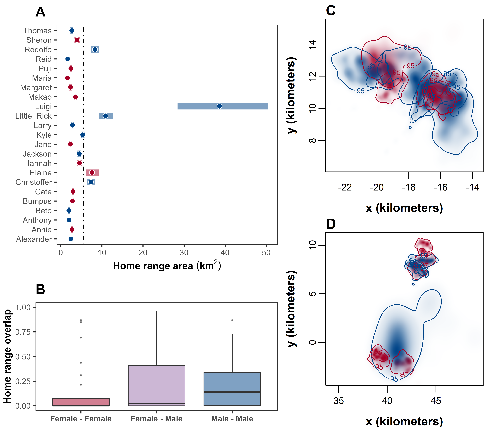

```{r setup, include=FALSE}
knitr::opts_chunk$set(echo = TRUE, eval=FALSE)
```

<hr style="border: 1px solid black;">

# **Overview**

Our primary aim was to understand the movement ecology of giant anteaters (*Myrmecophaga tridactyla*) at the social-spatial interface. Specifically, we aimed to address two overarching questions:

- Is the spatial arrangement of giant anteater home ranges governed by social factors (e.g., territoriality, mating groups, social groups, etc.)?
- Does giant anteater movement within their home range exhibit signs of social interactions (e.g., avoidance, attraction, correlated movement, etc.)?

In order to answer our two core research questions, we carried out three separate analyses focused on estimating patterns in: 

i) home-range overlap; 
ii) proximity and encounter rates; and 
iii) correlated movement. 

To do this, we used GPS data to quantify key socio-spatial patterns using the methods implemented in the `ctmm` package and the `corrMove` package in `R`. In this appendix, we describe the workflow and specific steps that was used to carry out in each of these analyses below.

Data visualisation and analysis were carried out using R (version 4.2.2, R Core Team, 2022) and the following R packages: ctmm (version 1.1.0, Fleming & Calabrese, 2022), lme4 (version 1.1.31, Bates et al., 2015), glmmTMB (version 1.1.7, Brooks et al., 2017), corrMove (version 0.1.0, Calabrese & Fleming, 2023), and ggplot2 (version 3.4.2, Wickham, 2016). All R scripts can be found in the GitHub repository at https://github.com/QuantitativeEcologyLab/Giant_Anteater. 

<hr style="border: 1px solid black;">

# **Data**

Before analysis, we calibrated the GPS measurement error and removed any outlying data points (for full details on data pre-processing see Appendix S2 in (Noonan et al., 2022). First step of the analysis is to import the data and convert to a telemetry object for use in the ```ctmm``` package. 

```{r load-packages, message = FALSE}
#load packages

#data, visualization
library(readr)
library(ggplot2)
# #library(khroma)          #colour blind friendly colour palette
library(dplyr)           #data wrangling
library(tidyr)           #data wrangling
# library(tibble)          #data wrangling
library(lubridate)       #yday() for timestamp; round_date() for corrMove
# #library(parsedate)
library(gridExtra)       #arrangement of plots for multi-panel figures
library(scales)          #scaling axis in plots
library(osmdata)         #open street map for base map
library(terra)           #raster data
library(tidyterra)       #raster data
library(sf)              #spatial data
# #library(geobr)           #shape files for Brazil
# #analysis
# library(devtools)
# #if the ctmm package needs to be updated
# #devtools::install_github("ctmm-initiative/ctmm", force = TRUE) 
library(ctmm)            #continuous-time movement models
library(lme4)            #pairwise sex test to see if differences are significant using glmer()
library(glmmTMB)         #beta distribution
# library(mgcv)            #gam() for encounters
# #if installing the corrMove package for the first time
# #devtools::install_github("jmcalabrese/corrMove", force = TRUE) 
library(corrMove)        #correlative movement
```

```{r load-files, echo=FALSE}
#load data
GPS_df <- readRDS("data/rds/GPS_df.rds")
bio_df <- readRDS("data/rds/bio_df.rds")
DATA_TELEMETRY <- readRDS("data/rds/DATA_TELEMETRY.rds")
#load movement models
FIT <- readRDS("rds/FIT.rds")
#load home range estimates
AKDE <- readRDS("rds/AKDE.rds")
AKDE_1 <- readRDS("rds/AKDE_1.rds")
AKDE_2 <- readRDS("rds/AKDE_2.rds")
AKDE_male <- readRDS("rds/AKDE_male.rds")
AKDE_female <- readRDS("rds/AKDE_female.rds")
#load home range size
HR_size <- readRDS("rds/HR_size.rds")
#load overlap estimates
overlap_1_df <- readRDS("rds/overlap_1_df.rds")
overlap_2_df <- readRDS("rds/overlap_2_df.rds")
overlap_df <- readRDS("rds/overlap_df.rds")
#load proximity data
proximity_df <- readRDS("rds/proximity_df.rds")
#load distance data
distance_df <- readRDS("data/rds/distance_df.rds")
#load pair data
proximity_identified_pairs_df <- readRDS("RDS/proximity_identified_pairs_df.rds")
distance_pairs_df <- readRDS("data/rds/distance_pairs_df.RDS")
#load correlative movement data
cm_pair1 <- readRDS("RDS/cm_pair1.RDS")
cm_pair2 <- readRDS("RDS/cm_pair2.RDS")
cm_pair3 <- readRDS("RDS/cm_pair3.RDS")
cm_pair4 <- readRDS("RDS/cm_pair4.RDS")
cm_pair5 <- readRDS("RDS/cm_pair5.RDS")
cm_pair6 <- readRDS("RDS/cm_pair6.RDS")
cm_pair7 <- readRDS("RDS/cm_pair7.RDS")
cm_pair8 <- readRDS("RDS/cm_pair8.RDS")
cm_pair9 <- readRDS("RDS/cm_pair9.RDS")
cm_pair10 <- readRDS("RDS/cm_pair10.RDS")
cm_pair11 <- readRDS("RDS/cm_pair11.RDS")
cm_pair12 <- readRDS("RDS/cm_pair12.RDS")
```


```{r import-data, message = FALSE}
#import data, cleaned giant anteater GPS tracking data, containing no outliers
DATA_GPS <- read_csv("data/Anteaters_NoOutliers.csv")

#import supplementary data containing biological information
DATA_META <- read_csv("data/Anteater_Results_Final.csv")

#correct mismatch ID entries
DATA_GPS$ID[DATA_GPS$ID == "Larry 267"] <- "Larry"
DATA_GPS$ID[DATA_GPS$ID == "Little Rick"] <- "Little_Rick"

#correct mismatch ID entries
DATA_META$ID[DATA_META$ID == "Little Rick"] <- "Little_Rick"
```

While a total of 43 individuals were collared as part of the larger monitoring effort (Noonan et al., 2022), here we restricted our analyses to 23 range-resident individuals living in three separate clusters. These individuals were selected as they resided in areas where there was high confidence that all resident giant anteaters were equipped with GPS trackers. The resulting dataset consisted of 528,324 GPS fixes.

```{r import-meta, message = FALSE}
#data wrangling

#subset to the 23 range-resident individuals
GPS_df <- DATA_GPS[which(DATA_GPS$ID %in% c("Alexander", "Annie", "Anthony", "Beto", "Bumpus",
                                            "Cate", "Christoffer","Elaine", "Hannah","Jackson",
                                            "Jane","Kyle", "Larry", "Little_Rick", "Luigi",
                                            "Makao", "Margaret", "Maria", "Puji", "Reid", 
                                            "Rodolfo", "Sheron", "Thomas")),]

#subset to the 23 range-resident individuals
bio_df <- DATA_META[c(1:3,8:10,12,14,17,19,20,22,23,25:29,33:35,37,38),]
#subset the biological data
bio_df <- bio_df[,c(1:3,5)]

#add site location to the dataframe
bio_df$Site <- NA
bio_df$Site[bio_df$Road == "MS-040"] <- 1
bio_df$Site[bio_df$Road == "BR_267"] <- 2
bio_df

#convert dataset to a telemetry object
DATA_TELEMETRY <- as.telemetry(GPS_df)

#summary of the dataset
summary(DATA_TELEMETRY)

#visualisation of the data
plot(DATA_TELEMETRY)
```

```{r eval = FALSE}
#save GPS dataframe
saveRDS(GPS_df, file = "data/rds/GPS_df.rds")
#save biological information dataframe
saveRDS(bio_df, file = "data/rds/bio_df.rds")
#save telemetry data
saveRDS(DATA_TELEMETRY, file = "data/rds/DATA_TELEMETRY.rds")
```

<hr style="border: 1px solid black;">

# **Movement Models**

After preparing the data, we fit the continuous-time movement models following the workflow described in Calabrese et al. (2016). 

```{r eval = FALSE}
#fit movement models
GUESS <- lapply(DATA_TELEMETRY[1:23], function(b) ctmm.guess(b,interactive=FALSE) )
FIT <- lapply(1:23, function(i) ctmm.select(DATA_TELEMETRY[[i]],GUESS[[i]]) )
names(FIT) <- names(DATA_TELEMETRY[1:23])
overlap(FIT)
```

```{r}
#summary of the fitted model
summary(FIT)
```

```{r eval = FALSE}
#save movement models
saveRDS(FIT, file = "rds/FIT.rds")
```

<hr style="border: 1px solid black;">

# **Home Range Overlap**

## Estimating home range areas

We estimated giant anteater home ranges using Autocorrelated Kernel Density Estimation (AKDE; Fleming et al., 2015) using the ```ctmm``` package. AKDE, corrects for autocorrelation induced bias (Noonan et al., 2019) by conditioning the bandwidth optimisation on the data’s autocorrelation structure (Fleming & Calabrese, 2017). Thus, home range estimation first required fitting a series of continuous-time movement models to the GPS tracking data and identifying the best model via small sample-sized corrected Akaike’s Information Criterion (AICc) (Fleming & Calabrese, 2022). Giant anteater home ranges were then estimated conditional on each individual’s best-fit movement model.


```{r eval = FALSE}
#calculate AKDE home range estimates based on the best fit model, create aligned UDs
AKDE <- akde(DATA_TELEMETRY[1:23],FIT)
overlap(AKDE)

#save AKDE home range estimations
saveRDS(AKDE, file = "rds/AKDE.rds")
```

## Home range results

```{r hr-size}
#create a dataframe to store home range area statistics from the AKDE
HR_size <- data.frame()

#loop through each object in the AKDE list
for (i in 1:length(AKDE)) {
  #extract the home range area statistics summary
  summary <- summary(AKDE[[i]])$CI
  
  #bind the summary to the dataframe
  HR_size <- rbind(HR_size, as.data.frame(summary))
}

row.names(HR_size) <- NULL

#add biological data to dataframe
HR_size <- cbind(HR_size, bio_df)
HR_size <- relocate(HR_size, c(low, est, high), .after = Site)
names(HR_size)[6] <- "HR_low"
names(HR_size)[7] <- "HR_est"
names(HR_size)[8] <- "HR_high"

```

```{r eval=FALSE}
saveRDS(HR_size, file = "rds/HR_size.rds")
```


```{r}
#calculate the mean total home range size
round(mean(HR_size$HR_est), 2)

#calculate CIs of the mean total home range size
round(mean(HR_size$HR_low), 2)
round(mean(HR_size$HR_high), 2)
```

Here, we calculate the home range statistics based on a sex parameter using `meta()` from the `ctmm` package.

```{r hr-sex-analysis}
#does home range size differ between sexes?

#subset each individual based on their sex
AKDE_male <- AKDE[c("Alexander", "Anthony", "Beto","Christoffer","Jackson",
                    "Kyle", "Larry", "Little_Rick", "Luigi", "Reid", 
                    "Rodolfo", "Thomas")]
AKDE_female <- AKDE[c("Annie", "Bumpus", "Cate", "Elaine", "Hannah",
                      "Jane","Makao", "Margaret", "Maria", "Puji",
                      "Sheron")]

#calculate mean home range sizes for male
meta(AKDE_male)

#calculate mean home range sizes for female
meta(AKDE_female)

#test to see significance of sex on home range
AKDE_sex_compare <- list(male = AKDE_male,
                         female = AKDE_female)
COL_sex <- c("#004488", "#A50026")
meta(AKDE_sex_compare, col = COL_sex, sort = TRUE)
```

```{r eval=FALSE}
saveRDS(AKDE_male, file = "rds/AKDE_male.rds")
saveRDS(AKDE_female, file = "rds/AKDE_female.rds")
```


---

## Estimating home range overlap

Home range overlap was estimated for all pairs of individuals (i.e., dyads) via the Bhattacharyya coefficient (Winner et al., 2018). 

```{r}
#subset home range overlap based on site location
AKDE_1 <- AKDE[c("Alexander", "Anthony", "Bumpus", "Cate", "Christoffer",
                 "Elaine", "Jackson", "Kyle", "Little_Rick", "Makao",
                 "Puji", "Rodolfo")]

AKDE_2 <- AKDE[c("Annie", "Beto", "Hannah", "Jane", "Larry",
                 "Luigi", "Margaret", "Maria", "Reid", "Sheron",
                 "Thomas")]
```

```{r eval=FALSE}
#save home range overlap for each site
saveRDS(AKDE_1, file = "rds/AKDE_1.rds")
saveRDS(AKDE_2, file = "rds/AKDE_2.rds")
```


```{r eval = FALSE}
#calculate 95% AKDE home range overlap for pairwise comparison for site 1
overlap_1 <- overlap(AKDE_1, level = 0.95)

#calculate 95% AKDE home range overlap for pairwise comparison for site 2
overlap_2 <- overlap(AKDE_2, level = 0.95)
```


```{r eval = FALSE}
#data wrangling

#create a pairwise dataframe by pairing up every individual at each site

# Site 1
#extract CI 'est' matrix from array
overlap_1_est <- overlap_1$CI[ , , 2]
#remove duplicate values of the matrix
overlap_1_est[upper.tri(overlap_1_est, diag = TRUE)] <- NA
#Create a new data frame based on the overlap values
overlap_1_df <- as.data.frame(overlap_1_est)
overlap_1_df$anteater_A <- rownames(overlap_1_df)
overlap_1_df <- pivot_longer(overlap_1_df, cols = -anteater_A, names_to = 'anteater_B', values_to = 'overlap_est', values_drop_na = TRUE)

#extract CI 'low' matrix from array
overlap_1_low <- overlap_1$CI[ , , 1]
#remove duplicate values of the matrix
overlap_1_low[upper.tri(overlap_1_low, diag = TRUE)] <- NA
#Create a new data frame based on the overlap values
overlap_1_low <- as.data.frame(overlap_1_low)
overlap_1_low$anteater_A <- rownames(overlap_1_low)
overlap_1_low <- pivot_longer(overlap_1_low, cols = -anteater_A, names_to = 'anteater_B', values_to = 'overlap_low', values_drop_na = TRUE)
overlap_1_df <- left_join(overlap_1_df, overlap_1_low, by = c("anteater_A", "anteater_B"))
overlap_1_df <- relocate(overlap_1_df, overlap_low, .before = overlap_est)

#extract CI 'high' matrix from array
overlap_1_high <- overlap_1$CI[ , , 3]
#remove duplicate values of the matrix
overlap_1_high[upper.tri(overlap_1_high, diag = TRUE)] <- NA
#Create a new data frame based on the overlap values
overlap_1_high <- as.data.frame(overlap_1_high)
overlap_1_high$anteater_A <- rownames(overlap_1_high)
overlap_1_high <- pivot_longer(overlap_1_high, cols = -anteater_A, names_to = 'anteater_B', values_to = 'overlap_high', values_drop_na = TRUE)
overlap_1_df <- left_join(overlap_1_df, overlap_1_high, by = c("anteater_A", "anteater_B"))

#add biological data to dataframe
overlap_1_df <- left_join(overlap_1_df, rename(bio_df, anteater_A = ID), by = "anteater_A")
overlap_1_df <- left_join(overlap_1_df, rename(bio_df, anteater_B = ID), by = "anteater_B", suffix = c(".A", ".B"))
#add column to indicate which sexes that are being compared
overlap_1_df <- mutate(overlap_1_df,
                       sex_comparison = case_when(paste(Sex.A, Sex.B) == "Male Male" ~ "male-male",
                                                  paste(Sex.A, Sex.B) == "Female Female" ~ "female-female",
                                                  paste(Sex.A, Sex.B) == "Male Female" ~ "female-male",
                                                  paste(Sex.A, Sex.B) == "Female Male" ~ "female-male"))
#assign site
overlap_1_df$site <- 1
overlap_1_df <- relocate(overlap_1_df, c("overlap_low", "overlap_est", "overlap_high"), .after = site)
```


```{r eval = FALSE}
# Site 2
#extract CI 'est' matrix from array
overlap_2_est <- overlap_2$CI[ , , 2]
#remove duplicate values of the matrix
overlap_2_est[upper.tri(overlap_2_est, diag = TRUE)] <- NA
#create a new data frame based on the overlap values
overlap_2_df <- as.data.frame(overlap_2_est)
overlap_2_df$anteater_A <- rownames(overlap_2_df)
overlap_2_df <- pivot_longer(overlap_2_df, cols = -anteater_A, names_to = 'anteater_B', values_to = 'overlap_est', values_drop_na = TRUE)

#extract CI 'low' matrix from array
overlap_2_low <- overlap_2$CI[ , , 1]
#remove duplicate values of the matrix
overlap_2_low[upper.tri(overlap_2_low, diag = TRUE)] <- NA
#create a new data frame based on the overlap values
overlap_2_low <- as.data.frame(overlap_2_low)
overlap_2_low$anteater_A <- rownames(overlap_2_low)
overlap_2_low <- pivot_longer(overlap_2_low, cols = -anteater_A, names_to = 'anteater_B', values_to = 'overlap_low', values_drop_na = TRUE)
overlap_2_df <- left_join(overlap_2_df, overlap_2_low, by = c("anteater_A", "anteater_B"))
overlap_2_df <- relocate(overlap_2_df, overlap_low, .before = overlap_est)

#extract CI 'high' matrix from array
overlap_2_high <- overlap_2$CI[ , , 3]
#remove duplicate values of the matrix
overlap_2_high[upper.tri(overlap_2_high, diag = TRUE)] <- NA
#create a new data frame based on the overlap values
overlap_2_high <- as.data.frame(overlap_2_high)
overlap_2_high$anteater_A <- rownames(overlap_2_high)
overlap_2_high <- pivot_longer(overlap_2_high, cols = -anteater_A, names_to = 'anteater_B', values_to = 'overlap_high', values_drop_na = TRUE)
overlap_2_df <- left_join(overlap_2_df, overlap_2_high, by = c("anteater_A", "anteater_B"))

#add biological data to dataframe
overlap_2_df <- left_join(overlap_2_df, rename(bio_df, anteater_A = ID), by = "anteater_A")
overlap_2_df <- left_join(overlap_2_df, rename(bio_df, anteater_B = ID), by = "anteater_B", suffix = c(".A", ".B"))
#add column to indicate which sexes that are being compared
overlap_2_df <- mutate(overlap_2_df,
                       sex_comparison = case_when(paste(Sex.A, Sex.B) == "Male Male" ~ "male-male",
                                                  paste(Sex.A, Sex.B) == "Female Female" ~ "female-female",
                                                  paste(Sex.A, Sex.B) == "Male Female" ~ "female-male",
                                                  paste(Sex.A, Sex.B) == "Female Male" ~ "female-male"))
#assign site
overlap_2_df$site <- 2
overlap_2_df <- relocate(overlap_2_df, c("overlap_low", "overlap_est", "overlap_high"), .after = site)
```

```{r eval = FALSE}
#combine both sites into one dataframe
overlap_df <- rbind(overlap_1_df, overlap_2_df)
overlap_df$pair_ID <- paste(overlap_df$anteater_A, overlap_df$anteater_B, sep = "_")
overlap_df <- relocate(overlap_df, pair_ID, .before = anteater_A)

#clean up environment
rm(overlap_1_low, overlap_1_est, overlap_1_high,
   overlap_2_low, overlap_2_est, overlap_2_high)
```

```{r eval = FALSE}
#save home range overlap for site 1
saveRDS(object = overlap_2_df, file = "rds/overlap_1_df.rds")
#save home range overlap for site 2
saveRDS(object = overlap_2_df, file = "rds/overlap_2_df.rds")
#save home range overlap dataframe
saveRDS(object = overlap_df, file = "rds/overlap_df.rds")
```

## Home range overlap results

```{r}
#calculate mean total home range overlap 
round(mean(overlap_df$overlap_est), 2)

#calculate range of total home range overlap 
round(min(overlap_df$overlap_est), 2)
round(max(overlap_df$overlap_est), 2)
```

To determine if sex was a factor underpinning the degree of pairwise overlap, we fit a Generalized Linear Mixed Model (GLMM) with a beta distribution and a logit link function to the home range overlap estimates, with pairwise sex as a predictor variable (i.e., male-male, female-female, and female-male). In addition, site was included as a random effect. Because the overlap values ranged between [0,1], we rescaled the values as (y(n-1) + 0.5)/n in order for them to lie within the (0,1) interval (Smithson & Verkuilen, 2006). This model was then compared to a similar model that excluded the pairwise sex predictor variable using a likelihood ratio test.

```{r}
min_val <- min(overlap_df$overlap_est)
max_val <- max(overlap_df$overlap_est)
squeeze_min <- 0.001
squeeze_max <- 0.999
overlap_df$overlap_est_squeezed <- ((overlap_df$overlap_est - min_val) / (max_val - min_val)) * (squeeze_max - squeeze_min) + squeeze_min
overlap_df <- relocate(overlap_df, overlap_est_squeezed, .after = overlap_high)

#test for significance in sex, compare model with and without sex as a variable
HRO_test <- glmmTMB(overlap_est_squeezed ~ sex_comparison + (1|site), family = beta_family(link = "logit"), data = overlap_df)
HRO_test2 <- glmmTMB(overlap_est_squeezed ~ 1 + (1|site), family = beta_family(link = "logit"), data = overlap_df)
HRO_test_results <- anova(HRO_test, HRO_test2)
HRO_test_pvalue <- round(HRO_test_results$`Pr(>Chisq)`[2], 2)
```

Home range overlap results based on sex comparison categories (ie. male-male, female-female, and female-male)

```{r}
#number of home range overlap in each sex comparison category
table(overlap_df$sex_comparison)

#calculate mean home range overlap & range based on sex comparison categories
round(mean(overlap_df$overlap_est[overlap_df$sex_comparison == "male-male"]), 2)
round(min(overlap_df$overlap_est[overlap_df$sex_comparison == "male-male"]), 2)
round(max(overlap_df$overlap_est[overlap_df$sex_comparison == "male-male"]), 2)

round(mean(overlap_df$overlap_est[overlap_df$sex_comparison == "female-female"]), 2)
round(min(overlap_df$overlap_est[overlap_df$sex_comparison == "female-female"]), 2)
round(max(overlap_df$overlap_est[overlap_df$sex_comparison == "female-female"]), 2)

round(mean(overlap_df$overlap_est[overlap_df$sex_comparison == "female-male"]), 2)
round(min(overlap_df$overlap_est[overlap_df$sex_comparison == "female-male"]), 2)
round(max(overlap_df$overlap_est[overlap_df$sex_comparison == "female-male"]), 2)
```


<hr style="border: 1px solid black;">

# **Proximity and Encounters**

While home-range overlap describes patterns in spatial structuring, it does not directly indicate whether individuals are likely to be in the same place at the same time (Winner et al., 2018). In order to understand the temporal component of giant anteaters’ socio-spatial behaviour, we estimated a proximity ratio for all dyads via the `ctmm` function `proximity()`. 

## Proximity

### Estimating proximity ratio

The proximity ratio was estimated by comparing a dyad’s observed separation distances with the separation distances expected under completely random movement. A proximity ratio of 1 is thus consistent with independent movement, values <1 indicate that the two individuals are closer on average than expected for independent movement, and vice versa for values >1. 

```{r}
#subset individual movement models based on their site location
FIT_1 <- FIT[c("Alexander", "Anthony", "Bumpus", "Cate", "Christoffer",
               "Elaine", "Jackson", "Kyle", "Little_Rick", "Makao",
               "Puji", "Rodolfo")]
FIT_2 <- FIT[c("Annie", "Beto", "Hannah", "Jane", "Larry",
               "Luigi", "Margaret", "Maria", "Reid", "Sheron",
               "Thomas")]
```

```{r eval = FALSE}
# Site 1
#create empty columns for results to be saved to
overlap_1_df$proximity_low <- NA
overlap_1_df$proximity_est <- NA
overlap_1_df$proximity_high <- NA

#Calculate the proximity statistics
for(i in 1:nrow(overlap_1)){
  ANIMAL_A <- as.character(overlap_1_df[i, 'anteater_A']) # add as.character due to tibble format
  ANIMAL_B <- as.character(overlap_1_df[i, 'anteater_B'])
  
  TRACKING_DATA.1 <- DATA_TELEMETRY[c(ANIMAL_A, ANIMAL_B)] # extract anteater by name, has extra layers .-. it doesnt work, that is why
  
  # line above is using as.character removes all the fluff because you just want the text string
  MODELS.1 <- list(FIT_1[ANIMAL_A][[1]], FIT_1[ANIMAL_B][[1]])
  
  PROXIMITY1 <- tryCatch(
    {
      PROXIMITY_1 <- proximity(data = TRACKING_DATA.1, CTMM = MODELS.1, GUESS=ctmm(error=FALSE))},
    error=function(err){
      PROXIMITY_1 <- c(NA,NA,NA)
      return(PROXIMITY_1)
    }
  )
  
  overlap_1_df[i, c("proximity_low")] <- PROXIMITY_1[1]
  overlap_1_df[i, c("proximity_est")] <- PROXIMITY_1[2]
  overlap_1_df[i, c("proximity_high")] <- PROXIMITY_1[3]
  
  #save results to a csv file
  write.csv(overlap_1_df, "data/DATA_proximity_1.csv", row.names = FALSE)
  
  cat("finished index", i, "\n") # see the loop happening in real time
}
```


```{r eval = FALSE}
# Site 2
#create empty columns for results to be saved to
overlap_2_df$proximity_low <- NA
overlap_2_df$proximity_est <- NA
overlap_2_df$proximity_high <- NA

#Calculate the proximity statistics
for(i in 1:nrow(overlap_2_df)){
  ANIMAL_A <- as.character(overlap_2_df[i, 'anteater_A']) # add as.character due to tibble format
  ANIMAL_B <- as.character(overlap_2_df[i, 'anteater_B'])
  
  TRACKING_DATA_2 <- DATA_TELEMETRY[c(ANIMAL_A, ANIMAL_B)] # extract anteater by name, has extra layers .-. it doesnt work, that is why
  
  # line above is using as.character removes all the fluff because you just want the text string
  MODELS_2 <- list(FIT_2[ANIMAL_A][[1]], FIT_2[ANIMAL_B][[1]])
  PROXIMITY_2 <- tryCatch(
    {
      #calculate the proximity statistic
      PROXIMITY_2 <- proximity(data = TRACKING_DATA_2, 
                               CTMM = MODELS_2, 
                               GUESS=ctmm(error=FALSE))},
    error=function(err){
      PROXIMITY_2 <- c(NA,NA,NA)
      return(PROXIMITY_2)
    }
  )
  overlap_2_df[i, c("proximity_low")] <- PROXIMITY_2[1]
  overlap_2_df[i, c("proximity_est")] <- PROXIMITY_2[2]
  overlap_2_df[i, c("proximity_high")] <- PROXIMITY_2[3]
  
  #save results in a csv file
  write.csv(overlap_2_df, "data/DATA_proximity_2.csv", row.names = FALSE)
  cat("finished index", i, "\n") # see the loop happening in real time
}
```


```{r eval = FALSE, message = FALSE}
#data wrangling

#import proximity data
DATA_proximity_1 <- read_csv("data/DATA_proximity_1.csv")
DATA_proximity_2 <- read_csv("data/DATA_proximity_2.csv")

#correct mismatch entry
DATA_proximity_1$anteater_A[DATA_proximity_1$anteater_A == "Little Rick"] <- "Little_Rick"
DATA_proximity_1$anteater_B[DATA_proximity_1$anteater_B == "Little Rick"] <- "Little_Rick"
DATA_proximity_2$anteater_A[DATA_proximity_2$anteater_A == "Larry 267"] <- "Larry"
DATA_proximity_2$anteater_B[DATA_proximity_2$anteater_B == "Larry 267"] <- "Larry"

#add missing site column to dataframe for site 2
DATA_proximity_2$site <- 2
DATA_proximity_2 <- relocate(DATA_proximity_2, site, .before = proximity_low)

proximity_df <- bind_rows(DATA_proximity_1, DATA_proximity_2)
proximity_df <- proximity_df[,-3]
proximity_df <- mutate(proximity_df,
                       sex_comparison = case_when(paste(Sex.A, Sex.B) == "Male Male" ~ "male-male",
                                                  paste(Sex.A, Sex.B) == "Female Female" ~ "female-female",
                                                  paste(Sex.A, Sex.B) == "Male Female" ~ "female-male",
                                                  paste(Sex.A, Sex.B) == "Female Male" ~ "female-male"))

#add home range overlap data to proximity dataframe
proximity_df <- left_join(overlap_df, proximity_df, by = c("anteater_A", "anteater_B",
                                                           "Sex.A", "Sex.B",
                                                           "Age.A", "Age.B",
                                                           "sex_comparison",
                                                           "site"))

```


```{r eval = FALSE}
#save proximity dataframe
saveRDS(proximity_df, file = "rds/proximity_df.rds")
```

### Proximity ratio results

We used a GLMM with a gamma distribution, a log link function, and site as a random effect to determine whether the estimated proximity ratios differed between pairwise sex combinations. This model was then compared to similar model that excluded the pairwise sex predictor variable using a likelihood ratio test.

```{r proximity-analysis}
#test for significance in sex, compare model with and without sex as a variable across all 121 dyads
proximity_test <- glmer(proximity_est ~ sex_comparison + (1|site), family = Gamma(link = "log"), data = proximity_df)
proximity_test2 <- glmer(proximity_est ~ 1 + (1|site), family = Gamma(link = "log"), data = proximity_df)
proximity_test_results <- anova(proximity_test, proximity_test2)
proximity_test_pvalue <- round(proximity_test_results$`Pr(>Chisq)`[2], 2) #p = 0.13

prox_overlap_test <- glmer(proximity_est ~ overlap_est + (1|site), family = Gamma(link = "log"), data = proximity_df)
prox_overlap_test2 <- glmer(proximity_est ~ 1 + (1|site), family = Gamma(link = "log"), data = proximity_df)
prox_overlap_test_results <- anova(prox_overlap_test, prox_overlap_test2)
prox_overlap_test_pvalue <- round(prox_overlap_test_results$`Pr(>Chisq)`[2], 2) #p = 0.03
```

---

## Encounters

In order to calculate the number of encounter events, we needed to estimate the Euclidean distance between the individuals in each dyads at each timepoint using the `ctmm` function `distances()`. From these separation distances we estimated the number of encounter events for each dyad using a 15m distance threshold. We also performed a sensitivity analysis on the 15m threshold. 

### Estimating distance

```{r eval = FALSE}

#Calculate the distance statistics
proximity_df$distance_low <- NA
proximity_df$distance_est <- NA
proximity_df$distance_high <- NA

RES <- list()

for (i in 1:nrow(overlap_df)) {
  ANIMAL_A <- as.character(overlap_df[i, 'anteater_A']) 
  ANIMAL_B <- as.character(overlap_df[i, 'anteater_B'])
  TRACKING_DATA <- DATA_TELEMETRY[c(ANIMAL_A, ANIMAL_B)]
  MODELS <- list(FIT[[ANIMAL_A]], FIT[[ANIMAL_B]])
  
  DISTANCES_RES <- tryCatch({
    distances_result <- distances(data = TRACKING_DATA, CTMM = MODELS, GUESS = ctmm(error = FALSE))
    data.frame(pair_ID = paste(ANIMAL_A, ANIMAL_B, sep = "_"),
               distance_low = distances_result$low, 
               distance_est = distances_result$est, 
               distance_high = distances_result$high,
               t = distances_result$t,
               timestamp = distances_result$timestamp)
  }, error = function(err) {
    data.frame(pair_ID = paste(ANIMAL_A, ANIMAL_B, sep = "_"),
               distance_low = NA,
               distance_est = NA,
               distance_high = NA,
               t = NA, 
               timestamp = NA)
  })
  
  RES[[i]] <- DISTANCES_RES
  
  #write.csv(RES, "data/DATA_distance.csv", row.names = FALSE)
  cat("finished index", i, "\n")
}

#Turn the list of list into a data frame
DATA_DISTANCE <- do.call(rbind, RES)

```


```{r eval = FALSE}
#save distance data
saveRDS(DATA_DISTANCE, file = "data/rds/DATA_DISTANCE.rds")
```


```{r eval = FALSE}
#import the distance data
DATA_DISTANCE <- readRDS("data/rds/DATA_DISTANCE.rds")

#locate NA values within the dataframe
DATA_DISTANCE[!complete.cases(DATA_DISTANCE), ] #3,502,701 observations
#drop the 3 fixes that had no distance values 
DATA_DISTANCE <- na.omit(DATA_DISTANCE) #3,502,698 observations

#add overlap and proximity information to the distance dataframe
distance_df <- merge(DATA_DISTANCE, proximity_df, by = "pair_ID")
distance_df <- relocate(distance_df, c(distance_low, distance_est, distance_high,
                                       t, timestamp), .after = proximity_high)
```

```{r eval = FALSE}
#save the distance dataframe
saveRDS(distance_df, file = "data/rds/distance_df.rds")
```

### Sensitivity analysis

```{r eval = FALSE}
#set encounter radius
#larger the radius = more encounters can occur within that radius due to more individuals that can be within the radius (measurements are in meters)
enc_radius <- 0:1000
enc_count <- vector("numeric", length(enc_radius))

#calculate the number of encounters occurring within each radius size
for(i in 1:length(enc_radius)){
  enc_count[i] <- sum(distance_df$distance_est < enc_radius[i])
}
```

```{r}
#to be ggplottified
plot(x = enc_radius, y = enc_count, type = "l")
```


```{r eval = FALSE}
#sensitivity analysis on female-male encounter significance
encounter_radius_pvalue <- vector("numeric", length(enc_radius))
pair_ID <- unique(overlap_df$pair_ID)

#Loop over encounter radii
for(i in 1:length(enc_radius)){
  
  res <- list()
  
  for (j in pair_ID){
    subset_A <- distance_df[distance_df$pair_ID == j,]
    
    # Count the number of times "distance_est" is below some threshold distance i 
    encounter_count <- sum(subset_A$distance_est < enc_radius[i])
    
    #save results
    res[[j]] <- data.frame(encounter_count = encounter_count,
                           overlap_est = subset_A$overlap_est[1],
                           sex_comparison = subset_A$sex_comparison[1],
                           site = subset_A$site[1])
    
  }
  
  res <- do.call(rbind, res)
  encounter_radius_test <- try(glmer(encounter_count ~ overlap_est + sex_comparison + (1|site),
                                     family = poisson(link = "log"), data = res, subset = res > 0))
  encounter_radius_test2 <- try(glmer(encounter_count ~ 1 + (1|site), family = poisson(link = "log"), data = res, subset = res > 0))
  encounter_radius_test_results <- try(anova(encounter_radius_test, encounter_radius_test2))
  p_val <- try(encounter_radius_test_results$`Pr(>Chisq)`[2])
  encounter_radius_pvalue[i] <- ifelse(class(p_val) == "try-error", NA, p_val)
  
  cat("finished index", i, "\n")
}

encounter_radius_df <- data.frame(x = enc_radius,
                                  y = encounter_radius_pvalue)

```

### Estimating encounters

```{r encounters}
#calculate total encounters of all individuals based on sex comparison type
proximity_df$encounter_count <- NA
pair_ID <- unique(proximity_df$pair_ID)

for (i in pair_ID){
  subset_A <- distance_df[distance_df$pair_ID == i,]
  
  # Count the number of times "distance_est" is below 15
  encounter_count <- sum(subset_A$distance_est < 15)
  
  #save results
  proximity_df[proximity_df$pair_ID == i, "encounter_count"] <- encounter_count
  
}

#number of pairs that had 0 encounters
proximity_df[proximity_df$encounter_count == 0,] #78
#number of pairs that had at least 1 encounter
proximity_df[proximity_df$encounter_count != 0,] #43

#calculate the number of encounters based on threshold
sum(proximity_df$encounter_count)
sum(proximity_df$encounter_count[proximity_df$sex_comparison == "male-male"])
sum(proximity_df$encounter_count[proximity_df$sex_comparison == "female-female"])
sum(proximity_df$encounter_count[proximity_df$sex_comparison == "female-male"])

```

### Encounter results

We used a GLMM with a Poisson distribution, a log link function, and site as a random effect to determine whether encounter rates differed between the pairwise sex combinations. This model was then compared to similar model that excluded the pairwise sex predictor variable using a likelihood ratio test. Additionally, we used a Hierarchical Generalized Additive Model (HGAM) with a Poisson distribution, a log link function, to test for any temporal trends in encounters.  

```{r encounter-analysis}
#effect of sex and overlap on encounter rates (model that does not include 0 encounter counts)
encounter_test <- glmer(encounter_count ~ overlap_est + sex_comparison + (1|site), family = poisson(link = "log"), data = proximity_df, subset = encounter_count > 0)
encounter_test2 <- glmer(encounter_count ~ 1 + (1|site), family = poisson(link = "log"), data = proximity_df, subset = encounter_count > 0)
encounter_test_results <- anova(encounter_test, encounter_test2)
encounter_test_pvalue <- round(encounter_test_results$`Pr(>Chisq)`[2], 2)

# amount of home-range overlap and the number of observed encounters (beta (B) = 4.86 ± 0.148, p = 0.00)
summary(encounter_test)
```

<hr style="border: 1px solid black;">

# **Correlative Movement**

To evaluate if pairs of giant anteaters exhibited any correlation in their movement, all dyads with a proximity ratio that differed significantly from 1 (based on the 95% confidence interval) were identified and carried forward to our subsequent, correlated movement analysis. 

## Exploring deviations in proximity ratios

```{r eval = FALSE}
#identify pairs that did not have a proximity ratio of 1
proximity_above1 <- proximity_df[proximity_df$proximity_low > 1,]
proximity_below1 <- proximity_df[proximity_df$proximity_high < 1,]

#exclude pairs with a HR overlap of 0
proximity_below1[proximity_below1$overlap_est == 0,]
proximity_below1 <- proximity_below1[proximity_below1$overlap_est != 0,]

#create a dataframe of the deviated pairs
proximity_identified_pairs_df <- rbind(proximity_above1, proximity_below1)
proximity_identified_pairs_df$pair_ID_number <- seq(from = 1, to = 12, by = 1)
proximity_identified_pairs_df <- relocate(proximity_identified_pairs_df, pair_ID_number, .before = anteater_A)

#correct the sex_comparison output to female-male
proximity_identified_pairs_df <- mutate(proximity_identified_pairs_df,
                                        sex_comparison = case_when(paste(Sex.A, Sex.B) == "Male Male" ~ "male-male",
                                                                   paste(Sex.A, Sex.B) == "Female Female" ~ "female-female",
                                                                   paste(Sex.A, Sex.B) == "Male Female" ~ "female-male",
                                                                   paste(Sex.A, Sex.B) == "Female Male" ~ "female-male"))

#clean up environment
rm(proximity_above1, proximity_below1)

saveRDS(proximity_identified_pairs_df, file = "rds/proximity_identified_pairs_df.rds")
```

## Deviated pairs results

```{r prox-pair-analysis}
#number of pairs with a deviated proximity ratio based on sex comparison (ie. a proximity ratio value not equal to 1)
table(proximity_identified_pairs_df$sex_comparison)

# Proximity ratio sex analysis for identified pairs
#test for significance in sex, compare model with and without sex as a variable
proximity_test_pairs <- glmer(proximity_est ~ sex_comparison + (1|site), family = Gamma(link = "log"), data = proximity_identified_pairs_df)
proximity_test2_pairs <- glmer(proximity_est ~ 1 + (1|site), family = Gamma(link = "log"), data = proximity_identified_pairs_df)
proximity_test_results_pairs <- anova(proximity_test_pairs, proximity_test2_pairs)
proximity_test_pvalue_pairs <- round(proximity_test_results_pairs$`Pr(>Chisq)`[2], 2) #0.16

# Proximity and overlap analysis for identified pairs
prox_overlap_test_pairs <- glmer(proximity_est ~ overlap_est + (1|site), family = Gamma(link = "log"), data = proximity_identified_pairs_df)
prox_overlap_test2_pairs <- glmer(proximity_est ~ 1 + (1|site), family = Gamma(link = "log"), data = proximity_identified_pairs_df)
prox_overlap_test_results_pairs <- anova(prox_overlap_test_pairs, prox_overlap_test2_pairs)
prox_overlap_test_pvalue_pairs <- round(prox_overlap_test_results_pairs$`Pr(>Chisq)`[2], 2) #0.65
```


## Estimating distances of the deviated pairs

```{r eval=FALSE}
#Calculate the instantaneous Euclidean distance between each proximity ratio identified pairs
pair1 <- DATA_TELEMETRY[c("Kyle","Christoffer")]
FIT_pair1 <- FIT[c("Kyle","Christoffer")]
# distance measurement and time between the pair
distance_pair1 <- distances(pair1, FIT_pair1) 

pair2 <- DATA_TELEMETRY[c("Elaine","Christoffer")]
FIT_pair2 <- FIT[c("Elaine","Christoffer")]
distance_pair2 <- distances(pair2, FIT_pair2) # distance measurement and time between the pair

pair3 <- DATA_TELEMETRY[c("Kyle","Bumpus")]
FIT_pair3 <- FIT[c("Kyle","Bumpus")]
distance_pair3 <- distances(pair3, FIT_pair3) # distance measurement and time between the pair

pair4 <- DATA_TELEMETRY[c("Little_Rick","Elaine")]
FIT_pair4 <- FIT[c("Little_Rick","Elaine")]
distance_pair4 <- distances(pair4, FIT_pair4) # distance measurement and time between the pair

pair5 <- DATA_TELEMETRY[c("Makao","Bumpus")]
FIT_pair5 <- FIT[c("Makao","Bumpus")]
distance_pair5 <- distances(pair5, FIT_pair5) # distance measurement and time between the pair

pair6 <- DATA_TELEMETRY[c("Puji","Bumpus")]
FIT_pair6 <- FIT[c("Puji","Bumpus")]
distance_pair6 <- distances(pair5, FIT_pair5) # distance measurement and time between the pair

pair7 <- DATA_TELEMETRY[c("Rodolfo", "Elaine")]
FIT_pair7 <- FIT[c("Rodolfo", "Elaine")]
distance_pair7 <- distances(pair7, FIT_pair7) # distance measurement and time between the pair

pair8 <- DATA_TELEMETRY[c("Larry","Annie")]
FIT_pair8 <- FIT[c("Larry","Annie")]
distance_pair8 <- distances(pair8, FIT_pair8) # distance measurement and time between the pair

pair9 <- DATA_TELEMETRY[c("Reid","Larry")]
FIT_pair9 <- FIT[c("Reid","Larry")]
distance_pair9 <- distances(pair9, FIT_pair9) # distance measurement and time between the pair

pair10 <- DATA_TELEMETRY[c("Sheron","Maria")]
FIT_pair10 <- FIT[c("Sheron","Maria")]
distance_pair10 <- distances(pair10, FIT_pair10) # distance measurement and time between the pair

pair11 <- DATA_TELEMETRY[c("Thomas","Margaret")]
FIT_pair11 <- FIT[c("Thomas","Margaret")]
distance_pair11 <- distances(pair11, FIT_pair11) # distance measurement and time between the pair

pair12 <- DATA_TELEMETRY[c("Thomas","Reid")]
FIT_pair12 <- FIT[c("Thomas","Reid")]
distance_pair12 <- distances(pair12, FIT_pair12) # distance measurement and time between the pair
```

```{r eval=FALSE}
distance_pair1$pair_ID_number <- 1
distance_pair1$anteater_A <- "Kyle"
distance_pair1$anteater_B <- "Christoffer"
distance_pair1$pair_ID <- paste(distance_pair1$anteater_A, distance_pair1$anteater_B, sep = "_")
distance_pair1 <- relocate(distance_pair1, c(pair_ID_number, pair_ID, anteater_A, anteater_B), .before = low)

distance_pair2$pair_ID_number <- 2
distance_pair2$anteater_A <- "Elaine"
distance_pair2$anteater_B <- "Christoffer"
distance_pair2$pair_ID <- paste(distance_pair2$anteater_A, distance_pair2$anteater_B, sep = "_")
distance_pair2 <- relocate(distance_pair2, c(pair_ID_number, pair_ID, anteater_A, anteater_B), .before = low)

distance_pair3$pair_ID_number <- 3
distance_pair3$anteater_A <- "Kyle"
distance_pair3$anteater_B <- "Bumpus"
distance_pair3$pair_ID <- paste(distance_pair3$anteater_A, distance_pair3$anteater_B, sep = "_")
distance_pair3 <- relocate(distance_pair3, c(pair_ID_number, pair_ID, anteater_A, anteater_B), .before = low)

distance_pair4$pair_ID_number <- 4
distance_pair4$anteater_A <- "Little_Rick"
distance_pair4$anteater_B <- "Elaine"
distance_pair4$pair_ID <- paste(distance_pair4$anteater_A, distance_pair4$anteater_B, sep = "_")
distance_pair4 <- relocate(distance_pair4, c(pair_ID_number, pair_ID, anteater_A, anteater_B), .before = low)

distance_pair5$pair_ID_number <- 5
distance_pair5$anteater_A <- "Makao"
distance_pair5$anteater_B <- "Bumpus"
distance_pair5$pair_ID <- paste(distance_pair5$anteater_A, distance_pair5$anteater_B, sep = "_")
distance_pair5 <- relocate(distance_pair5, c(pair_ID_number, pair_ID, anteater_A, anteater_B), .before = low)

distance_pair6$pair_ID_number <- 6
distance_pair6$anteater_A <- "Puji"
distance_pair6$anteater_B <- "Bumpus"
distance_pair6$pair_ID <- paste(distance_pair6$anteater_A, distance_pair6$anteater_B, sep = "_")
distance_pair6 <- relocate(distance_pair6, c(pair_ID_number, pair_ID, anteater_A, anteater_B), .before = low)

distance_pair7$pair_ID_number <- 7
distance_pair7$anteater_A <- "Rodolfo"
distance_pair7$anteater_B <- "Elaine"
distance_pair7$pair_ID <- paste(distance_pair7$anteater_A, distance_pair7$anteater_B, sep = "_")
distance_pair7 <- relocate(distance_pair7, c(pair_ID_number, pair_ID, anteater_A, anteater_B), .before = low)

distance_pair8$pair_ID_number <- 8
distance_pair8$anteater_A <- "Larry"
distance_pair8$anteater_B <- "Annie"
distance_pair8$pair_ID <- paste(distance_pair8$anteater_A, distance_pair8$anteater_B, sep = "_")
distance_pair8 <- relocate(distance_pair8, c(pair_ID_number, pair_ID, anteater_A, anteater_B), .before = low)

distance_pair9$pair_ID_number <- 9
distance_pair9$anteater_A <- "Reid"
distance_pair9$anteater_B <- "Larry"
distance_pair9$pair_ID <- paste(distance_pair9$anteater_A, distance_pair9$anteater_B, sep = "_")
distance_pair9 <- relocate(distance_pair9, c(pair_ID_number, pair_ID, anteater_A, anteater_B), .before = low)

distance_pair10$pair_ID_number <- 10
distance_pair10$anteater_A <- "Sheron"
distance_pair10$anteater_B <- "Maria"
distance_pair10$pair_ID <- paste(distance_pair10$anteater_A, distance_pair10$anteater_B, sep = "_")
distance_pair10 <- relocate(distance_pair10, c(pair_ID_number, pair_ID, anteater_A, anteater_B), .before = low)

distance_pair11$pair_ID_number <- 11
distance_pair11$anteater_A <- "Thomas"
distance_pair11$anteater_B <- "Margaret"
distance_pair11$pair_ID <- paste(distance_pair11$anteater_A, distance_pair11$anteater_B, sep = "_")
distance_pair11 <- relocate(distance_pair11, c(pair_ID_number, pair_ID, anteater_A, anteater_B), .before = low)

distance_pair12$pair_ID_number <- 12
distance_pair12$anteater_A <- "Thomas"
distance_pair12$anteater_B <- "Reid"
distance_pair12$pair_ID <- paste(distance_pair12$anteater_A, distance_pair12$anteater_B, sep = "_")
distance_pair12 <- relocate(distance_pair12, c(pair_ID_number, pair_ID, anteater_A, anteater_B), .before = low)

#combine into a dataframe
distance_pairs_df <- rbind(distance_pair1, distance_pair2, distance_pair3, distance_pair4,
                           distance_pair5, distance_pair6, distance_pair7, distance_pair8,
                           distance_pair9, distance_pair10, distance_pair11, distance_pair12)

#clean up environment
rm(distance_pair1, distance_pair2, distance_pair3, distance_pair4, distance_pair5,
   distance_pair6, distance_pair7, distance_pair8, distance_pair9, distance_pair10,
   distance_pair11, distance_pair12)

```

```{r eval = FALSE}
#save the distance dataframe of the deviated pairs
saveRDS(object = distance_pairs_df, file = "data/rds/distance_pairs_df.rds")
```


```{r eval=FALSE}
#subset individuals from the telemetry data with deviated proximity ratios
Bumpus <- DATA_TELEMETRY$Bumpus
Christoffer <- DATA_TELEMETRY$Christoffer
Elaine <- DATA_TELEMETRY$Elaine
Kyle <- DATA_TELEMETRY$Kyle
Little_rick <- DATA_TELEMETRY$Little_Rick
Makao <- DATA_TELEMETRY$Makao
Puji <- DATA_TELEMETRY$Puji
Rodolfo <- DATA_TELEMETRY$Rodolfo
Annie <- DATA_TELEMETRY$Annie
Larry <- DATA_TELEMETRY$Larry
Margaret <- DATA_TELEMETRY$Margaret
Maria <- DATA_TELEMETRY$Maria
Sheron <- DATA_TELEMETRY$Sheron
Reid <- DATA_TELEMETRY$Reid
Thomas <- DATA_TELEMETRY$Thomas

#create a dataframe of an individual's GPS coordinates, format dataset for corrMove analysis
Bumpus_GPS <- data.frame(timestamp = round_date(Bumpus$timestamp, "20 minutes"),
                         Bumpus.x = Bumpus$longitude,
                         Bumpus.y = Bumpus$latitude)
Christoffer_GPS <- data.frame(timestamp = round_date(Christoffer$timestamp, "20 minutes"),
                              Christoffer.x = Christoffer$longitude,
                              Christoffer.y = Christoffer$latitude)
Elaine_GPS <- data.frame(timestamp = round_date(Elaine$timestamp, "20 minutes"),
                         Elaine.x = Elaine$longitude,
                         Elaine.y = Elaine$latitude)
Kyle_GPS <- data.frame(timestamp = round_date(Kyle$timestamp, "20 minutes"),
                       Kyle.x = Kyle$longitude,
                       Kyle.y = Kyle$latitude)
Little_rick_GPS <- data.frame(timestamp = round_date(Little_rick$timestamp, "20 minutes"),
                              Little_rick.x = Little_rick$longitude,
                              Little_rick.y = Little_rick$latitude)
Makao_GPS <- data.frame(timestamp = round_date(Makao$timestamp, "20 minutes"),
                        Makao.x = Makao$longitude,
                        Makao.y = Makao$latitude)
Puji_GPS <- data.frame(timestamp = round_date(Puji$timestamp, "20 minutes"),
                       Puji.x = Puji$longitude,
                       Puji.y = Puji$latitude)
Rodolfo_GPS <- data.frame(timestamp = round_date(Rodolfo$timestamp, "20 minutes"),
                          Rodolfo.x = Rodolfo$longitude,
                          Rodolfo.y = Rodolfo$latitude)
Annie_GPS <- data.frame(timestamp = round_date(Annie$timestamp, "20 minutes"),
                        Annie.x = Annie$longitude,
                        Annie.y = Annie$latitude)
Larry_GPS <- data.frame(timestamp = round_date(Larry$timestamp, "20 minutes"),
                        Larry.x = Larry$longitude,
                        Larry.y = Larry$latitude)
Margaret_GPS <- data.frame(timestamp = round_date(Margaret$timestamp, "20 minutes"),
                           Margaret.x = Margaret$longitude,
                           Margaret.y = Margaret$latitude)
Maria_GPS <- data.frame(timestamp = round_date(Maria$timestamp, "20 minutes"),
                        Maria.x = Maria$longitude,
                        Maria.y = Maria$latitude)
Sheron_GPS <- data.frame(timestamp = round_date(Sheron$timestamp, "20 minutes"),
                         Sheron.x = Sheron$longitude,
                         Sheron.y = Sheron$latitude)
Reid_GPS <- data.frame(timestamp = round_date(Reid$timestamp, "20 minutes"),
                       Reid.x = Reid$longitude,
                       Reid.y = Reid$latitude)
Thomas_GPS <- data.frame(timestamp = round_date(Thomas$timestamp, "20 minutes"),
                         Thomas.x = Thomas$longitude,
                         Thomas.y = Thomas$latitude)

#combine the GPS coordinates of pairs together
#reorganize dataframe needed for corrMove into format required: timestamp, ID1 x coord, ID2 x coord, ID1 y coord, ID2 y coord
#remove duplicate timestamps

#Create corrData object, manually not using as.corrData()
cd_pair1 <- merge(Kyle_GPS, Christoffer_GPS)
cd_pair1 <- cd_pair1[, c(1,2,4,3,5)]
cd_pair1 <- cd_pair1[!duplicated(cd_pair1$timestamp),]

cd_pair2 <- merge(Elaine_GPS, Christoffer_GPS)
cd_pair2 <- cd_pair2[, c(1,2,4,3,5)]
cd_pair2 <- cd_pair2[!duplicated(cd_pair2$timestamp),]

cd_pair3 <- merge(Kyle_GPS, Bumpus_GPS, )
cd_pair3 <- cd_pair3[, c(1,2,4,3,5)]
cd_pair3 <- cd_pair3[!duplicated(cd_pair3$timestamp),]

cd_pair4 <- merge(Little_rick_GPS, Elaine_GPS)
cd_pair4 <- cd_pair4[, c(1,2,4,3,5)]
cd_pair4 <- cd_pair4[!duplicated(cd_pair4$timestamp),]

cd_pair5 <- merge(Makao_GPS, Bumpus_GPS)
cd_pair5 <- cd_pair5[, c(1,2,4,3,5)]
cd_pair5 <- cd_pair5[!duplicated(cd_pair5$timestamp),]

cd_pair6 <- merge(Puji_GPS, Bumpus_GPS)
cd_pair6 <- cd_pair6[, c(1,2,4,3,5)]
cd_pair6 <- cd_pair6[!duplicated(cd_pair6$timestamp),]

cd_pair7 <- merge(Rodolfo_GPS, Elaine_GPS)
cd_pair7 <- cd_pair7[, c(1,2,4,3,5)]
cd_pair7 <- cd_pair7[!duplicated(cd_pair7$timestamp),]

cd_pair8 <- merge(Larry_GPS, Annie_GPS)
cd_pair8 <- cd_pair8[, c(1,2,4,3,5)]
cd_pair8 <- cd_pair8[!duplicated(cd_pair8$timestamp),]

cd_pair9 <- merge(Reid_GPS, Larry_GPS)
cd_pair9 <- cd_pair9[, c(1,2,4,3,5)]
cd_pair9 <- cd_pair9[!duplicated(cd_pair9$timestamp),]

cd_pair10 <- merge(Sheron_GPS, Maria_GPS)
cd_pair10 <- cd_pair10[, c(1,2,4,3,5)]
cd_pair10 <- cd_pair10[!duplicated(cd_pair10$timestamp),]

cd_pair11 <- merge(Thomas_GPS, Margaret_GPS)
cd_pair11 <- cd_pair11[, c(1,2,4,3,5)]
cd_pair11 <- cd_pair11[!duplicated(cd_pair11$timestamp),]

cd_pair12 <- merge(Thomas_GPS, Reid_GPS)
cd_pair12 <- cd_pair12[, c(1,2,4,3,5)]
cd_pair12 <- cd_pair12[!duplicated(cd_pair12$timestamp),]

```

## Estimating correlative movement

For these 12 dyads, we used the methods implemented in the corrMove package to estimate the amount of correlation in the drift and diffusion components of those dyads’ movement (Calabrese et al., 2018). Under an assumption of Brownian motion, the corrMove algorithm estimates transition points between a family of four possible movement models; uncorrelated drift and uncorrelated diffusion (UU), correlated drift and uncorrelated diffusion (CU), uncorrelated drift and correlated diffusion (UC), and correlated drift and correlated diffusion (CC) (Calabrese et al., 2018). The most appropriate model for any time window was identified via AICc based model selection. 

```{r corrmove, eval = FALSE}
#Estimate the partition points
prts_pair1 <- findPrts(cd_pair1, W=5, IC = 2)
#Get the MCI estimates and selected model conditional on the data and partition points
cm_pair1 <- corrMove(cd_pair1, prts_pair1)

#Estimate the partition points
prts_pair2 <- findPrts(cd_pair2, W=5, IC = 2)
#Get the MCI estimates and selected model conditional on the data and partition points
cm_pair2 <- corrMove(cd_pair2, prts_pair2)

#Estimate the partition points
prts_pair3 <- findPrts(cd_pair3, W=5, IC = 2)
#Get the MCI estimates and selected model conditional on the data and partition points
cm_pair3 <- corrMove(cd_pair3, prts_pair3)

#Estimate the partition points
prts_pair4 <- findPrts(cd_pair4, W=5, IC = 2)
#Get the MCI estimates and selected model conditional on the data and partition points
cm_pair4 <- corrMove(cd_pair4, prts_pair4)

#Estimate the partition points
prts_pair5 <- findPrts(cd_pair5, W=5, IC = 2)
#Get the MCI estimates and selected model conditional on the data and partition points
cm_pair5 <- corrMove(cd_pair5, prts_pair5)

#Estimate the partition points
prts_pair6 <- findPrts(cd_pair6, W=5, IC = 2)
#Get the MCI estimates and selected model conditional on the data and partition points
cm_pair6 <- corrMove(cd_pair6, prts_pair6)

#Estimate the partition points 
prts_pair7 <- findPrts(cd_pair7, W=5, IC = 2)
#Get the MCI estimates and selected model conditional on the data and partition points
cm_pair7 <- corrMove(cd_pair7, prts_pair7)

#Estimate the partition points
prts_pair8 <- findPrts(cd_pair8, W=5, IC = 2)
#Get the MCI estimates and selected model conditional on the data and partition points
cm_pair8 <- corrMove(cd_pair8, prts_pair8)

#Estimate the partition points
prts_pair9 <- findPrts(cd_pair9, W=5, IC = 2)
#Get the MCI estimates and selected model conditional on the data and partition points
cm_pair9 <- corrMove(cd_pair9, prts_pair9)

#Estimate the partition points
prts_pair10 <- findPrts(cd_pair10, W=5, IC = 2)
#Get the MCI estimates and selected model conditional on the data and partition points
cm_pair10 <- corrMove(cd_pair10, prts_pair10)

#Estimate the partition points
prts_pair11 <- findPrts(cd_pair11, W=5, IC = 2)
#Get the MCI estimates and selected model conditional on the data and partition points
cm_pair11 <- corrMove(cd_pair11, prts_pair11)

#Estimate the partition points
prts_pair12 <- findPrts(cd_pair12, W=5, IC = 2)
#Get the MCI estimates and selected model conditional on the data and partition points
cm_pair12 <- corrMove(cd_pair12, prts_pair12)

```

```{r eval = FALSE}
saveRDS(cm_pair1, file = "RDS/cm_pair1.RDS")
saveRDS(cm_pair2, file = "RDS/cm_pair2.RDS")
saveRDS(cm_pair3, file = "RDS/cm_pair3.RDS")
saveRDS(cm_pair4, file = "RDS/cm_pair4.RDS")
saveRDS(cm_pair5, file = "RDS/cm_pair5.RDS")
saveRDS(cm_pair6, file = "RDS/cm_pair6.RDS")
saveRDS(cm_pair7, file = "RDS/cm_pair7.RDS")
saveRDS(cm_pair8, file = "RDS/cm_pair8.RDS")
saveRDS(cm_pair9, file = "RDS/cm_pair9.RDS")
saveRDS(cm_pair10, file = "RDS/cm_pair10.RDS")
saveRDS(cm_pair11, file = "RDS/cm_pair11.RDS")
saveRDS(cm_pair12, file = "RDS/cm_pair12.RDS")
```

## Correlative movement results

From these analyses, we obtained information on the length of time for which the dyad exhibited behaviour consistent with the selected movement model, as well as the correlation coefficients for the drift and diffusion terms (ranging between –1, indicating avoidance, and 1, indicating following). 

```{r corrmove-analysis}
#create a new dataframe for correlative movement data
corrmove_df <- proximity_identified_pairs_df

#create empty columns
corrmove_df$mean_etaTot.CI.Low <- NA
corrmove_df$mean_etaTot.MLE <- NA
corrmove_df$mean_etaTot.CI.Upp <- NA

#iterate over pair_ID_number values
for (i in 1:12) {
  #get the corresponding cm_pair
  cm_pair <- get(paste0("cm_pair", i))
  
  # calculate means
  mean_etaTot_CI_Low <- mean(cm_pair$etaTot.CI.Low)
  mean_etaTot_MLE <- mean(cm_pair$etaTot.MLE)
  mean_etaTot_CI_Upp <- mean(cm_pair$etaTot.CI.Upp)
  
  #save results with mean values to the empty columns
  corrmove_df$mean_etaTot.CI.Low[corrmove_df$pair_ID_number == i] <- mean_etaTot_CI_Low
  corrmove_df$mean_etaTot.MLE[corrmove_df$pair_ID_number == i] <- mean_etaTot_MLE
  corrmove_df$mean_etaTot.CI.Upp[corrmove_df$pair_ID_number == i] <- mean_etaTot_CI_Upp
}

#mean amount of total correlation in all identified pairs movement
round(mean(corrmove_df$mean_etaTot.CI.Low[-1]), 2)
round(mean(corrmove_df$mean_etaTot.MLE[-1]), 2)
round(mean(corrmove_df$mean_etaTot.CI.Upp[-1]), 2)

#calculate mean total drift and mean total diffusion correlative movement for the 12 pairs
# initialize columns
corrmove_df$mean_etaDif.MLE <- NA
corrmove_df$mean_etaDft.MLE <- NA

# iterate over pair_ID_number values
for (i in 1:12) {
  # get the corresponding cm_pair
  cm_pair <- get(paste0("cm_pair", i))
  
  # calculate means
  mean_etaDif_MLE <- mean(cm_pair$etaDif.MLE)
  mean_etaDft_MLE <- mean(cm_pair$etaDft.MLE)
  
  #save results with mean values
  corrmove_df$mean_etaDif.MLE[corrmove_df$pair_ID_number == i] <- mean_etaDif_MLE
  corrmove_df$mean_etaDft.MLE[corrmove_df$pair_ID_number == i] <- mean_etaDft_MLE
}

#mean total drift and mean total diffusion correlative movement
round(mean(corrmove_df$mean_etaDif.MLE[-1]), 2)
round(mean(corrmove_df$mean_etaDft.MLE[-1]), 2)
```

## Case study

As a case example for these general trends, we present a more in-depth exploration for “Thomas” and “Margaret”, a female-male dyad that exhibited substantial home-range overlap as well as a proximity ratio which suggested significant attraction. While we only presented results for a single dyad, similar patterns were observed across all dyads.


```{r case-study}
#home range size
AKDE_thomas <- AKDE["Thomas"]
AKDE_margaret <- AKDE["Margaret"]

#calculate mean home-range sizes for Thomas
meta(AKDE_thomas)

#calculate mean home-range sizes for Margaret
meta(AKDE_margaret)

#home range overlap
round(proximity_identified_pairs_df[11,]$overlap_low, 2)
round(proximity_identified_pairs_df[11,]$overlap_est, 2)
round(proximity_identified_pairs_df[11,]$overlap_high, 2)

round(proximity_identified_pairs_df$proximity_low[proximity_identified_pairs_df$pair_ID_number == 11], 2)
round(proximity_identified_pairs_df$proximity_est[proximity_identified_pairs_df$pair_ID_number == 11], 2)
round(proximity_identified_pairs_df$proximity_high[proximity_identified_pairs_df$pair_ID_number == 11], 2)

#distances are in meters, convert to km
round(mean(distance_pairs_df$est[distance_pairs_df$pair_ID_number == 11])/1000, 2)
round(min(distance_pairs_df$est[distance_pairs_df$pair_ID_number == 11])/1000, 2)
round(max(distance_pairs_df$est[distance_pairs_df$pair_ID_number == 11])/1000, 2)

#mean 95% CI correlative movement
round(mean(cm_pair11$etaTot.CI.Low), 2)
round(mean(cm_pair11$etaTot.MLE), 2)
round(mean(cm_pair11$etaTot.CI.Upp), 2)
```


# **Figures**

## Figure 1

```{r figure-1-base-map}
# Figure 1: map and gps tracking data

#Get bounding box for the geographic location of a city (eg. Campo Grande, Brazil)
#bbox <- getbb("Campo Grande Brazil")
bbox <- getbb("Nova Alvorada do Sul Brazil")


#Add OSM features for roads
roads <- add_osm_feature(opq(bbox), key = "highway", 
                         value = c("trunk", "motorway", "primary", "secondary", "tertiary"))
#Retrieve OSM data as an sf object
roads <- osmdata_sf(roads)

# Create an overpass query for medium/small streets
secondary_roads <- add_osm_feature(opq(bbox), key = "highway", 
                                   value = c("residential",
                                             "living_street",
                                             "unclassified",
                                             "service",
                                             "footway",
                                             "unpaved",
                                             "motorway_link",
                                             "trunk_link",
                                             "primary_link",
                                             "secondary_link",
                                             "tertiary_link"))


#Retrieve OSM data as an sf object
secondary_roads <- osmdata_sf(secondary_roads)


# Create an overpass query for medium/small streets
dirt_roads <- add_osm_feature(opq(bbox), key = "highway", 
                                   value = c("track"))


#Retrieve OSM data as an sf object
dirt_roads <- osmdata_sf(dirt_roads)


#Create an overpass query for water
rivers <- add_osm_feature(opq(bbox), key = "waterway", 
                         value = c("river"))
#Retrieve OSM data as an sf object
rivers <- osmdata_sf(rivers)

#Create an overpass query for water
streams <- add_osm_feature(opq(bbox), key = "waterway", 
                          value = c("stream"))
#Retrieve OSM data as an sf object
streams <- osmdata_sf(streams)

```

```{r raster-data}
#import raster data
pasture <- terra::rast("data/map/pasture.TIF")
pasture[pasture == 0] <- NA
pasture[pasture == 1] <- 1

planted_forest <- terra::rast("data/map/planted_forest.TIF")
planted_forest[planted_forest == 0] <- NA
planted_forest[planted_forest == 1] <- 3

native_forest <- terra::rast("data/map/native_forest.TIF")
native_forest[native_forest == 0] <- NA
native_forest[native_forest == 1] <- 2
```

```{r sf-object}
#add biological data to gps dataframe
gps_df <- left_join(GPS_df, bio_df, by = "ID")

#convert the GPS data into an sf object (assuming your data is in WGS 84 coordinate reference system (EPSG:4326)
gps_sf <- st_as_sf(gps_df, coords = c("GPS.Longitude", "GPS.Latitude"), 
                   crs = 4326)

#Find the range (extent) of the GPS coordinates (the area where the data located) of the spatial object
gps_sf_ext <- ext(gps_sf) #(xmin, xmax, ymin, ymax)

#manually define the bounding box of the plot (slightly larger than the gps data but smaller than raster bounding box) used for coord_sf() in ggplot() using the gps extent values
-53.79925 - 0.01
-53.474271 + 0.01
-21.772054 - 0.01
-21.08363 + 0.01
```

```{r plot-map}
figure1_map <-
  ggplot() +
  geom_spatraster(data = native_forest, aes(fill = native_forest), na.rm = T) +
  geom_spatraster(data = planted_forest, aes(fill = planted_forest), na.rm = T) +
  geom_spatraster(data = pasture, aes(fill = pasture), na.rm = T) +
  scale_fill_gradientn(colours = alpha(c("#eddea4", "#84a98c", "#52796f"), 0.7),
                       na.value = "transparent") +
   geom_sf(data = rivers$osm_lines,
           inherit.aes = FALSE,
           color = "#2c7fb8",
           lwd = 0.3) +
  geom_sf(data = streams$osm_lines,
          inherit.aes = FALSE,
          color = "#2c7fb8",
          lwd = 0.2) +
  geom_sf(data = roads$osm_lines,
          inherit.aes = FALSE,
          color = "#212529",
          lwd = 0.3) +
  geom_sf(data = secondary_roads$osm_lines,
          inherit.aes = FALSE,
          color = "#6c757d",
          lwd = 0.2) +
  geom_sf(data = dirt_roads$osm_lines,
          inherit.aes = FALSE,
          color = "#a68a64",
          lwd = 0.2) +
    geom_sf(data = gps_sf, aes(color = Sex),
            size = 0.05, alpha = 0.5, pch = 16) +
    scale_color_manual(values = c('#004488', '#A50026'), breaks = c('Male', 'Female')) +
  theme_bw() +
  theme(panel.grid.major = element_blank(),
        panel.grid.minor = element_blank(),
        plot.title = element_text(size = 14, family = "sans", face = "bold"),
        axis.title.y = element_text(size=10, family = "sans", face = "bold"),
        axis.title.x = element_text(size=10, family = "sans", face = "bold"),
        axis.text.y = element_text(size=5, family = "sans"),
        axis.text.x  = element_text(size=5, family = "sans"),
        legend.position="none",
        # legend.text = element_text(size=6, family = "sans", face = "bold"),
        # legend.position = c(0.84, 0.2), #horizontal, vertical
        # legend.key.height = unit(0.3, "cm"),
        # legend.key=element_blank(),
        panel.background = element_rect(fill = "#e9ecef"),
        # legend.background = element_rect(fill = "transparent"),
        plot.background = element_rect(fill = "transparent", color = NA),
        plot.margin = unit(c(0.2,0.1,0.2,0.2), "cm")) + #top, right, bot, left
  coord_sf(xlim = c(-53.80925, -53.46427), #lat
           ylim = c(-21.78205, -21.07363)) #long
figure1_map
```


```{r eval=FALSE}
ggsave(figure1_map, width = 3.23, height = 6, units = "in", dpi = 600, bg = "transparent",
       file="figures/figure1.png")
```


## Figure 2

```{r figure-2a}
# Figure 2A: Home range size

mean_HR_est <- round(mean(HR_size$HR_est), 2)

figure2a_HR_size <- 
  ggplot() +
  geom_vline(data = HR_size, aes(xintercept = mean_HR_est),
             linetype = "dotdash") +
  geom_linerange(data = HR_size, 
                 aes(xmin = HR_low, xmax = HR_high, y = ID, color = Sex),
                 linewidth = 3, alpha = 0.5) + 
  labs(x = bquote(bold("Home range area" ~ (km^2))),
       y = "") +
  ggtitle("A") +
  scale_color_manual(values = c('#004488', '#A50026'), breaks = c('Male', 'Female')) +
  geom_point(data = HR_size,
             aes(x = HR_est, y = ID, fill = "white"), color = "white",
             size = 2) +
  geom_point(data = HR_size, 
             aes(x = HR_est, y = ID, color = Sex),
             size = 1.5) +
  theme_bw() +
  theme(panel.grid.major = element_blank(),
        panel.grid.minor = element_blank(),
        plot.title = element_text(hjust = -0.1, size = 14, family = "sans", face = "bold"),
        axis.title.y = element_text(size=10, family = "sans", face = "bold"),
        axis.title.x = element_text(size=10, family = "sans", face = "bold"),
        axis.text.y = element_text(size=8, family = "sans"),
        axis.text.x  = element_text(size=8, family = "sans"),
        legend.position="none",
        panel.background = element_rect(fill = "transparent"),
        plot.background = element_rect(fill = "transparent", color = NA))
```

```{r eval=FALSE}
ggsave(figure2a_HR_size, filename = "figures/individual figures/figure2a_HR_size.png", device = NULL,
       path = NULL, scale = 1, width = 6.86, height = 4, units = "in", dpi = 600)
```


```{r figure-2b}
# Figure 2B: Home range overlap sex comparison

figure2b_overlap_sex <-
  ggplot(data = overlap_df, 
         mapping = aes(x = sex_comparison, y = overlap_est, fill = sex_comparison)) + 
  geom_boxplot(alpha = 0.5, size = 0.3, outlier.size = 0.3) +
  ylab("Home range overlap") +
  xlab("Sex") +
  ggtitle("B") +
  theme_bw() +
  theme(panel.grid.major = element_blank(),
        panel.grid.minor = element_blank(),
        plot.title = element_text(size = 14, family = "sans", face = "bold"),
        axis.title.y = element_text(size=10, family = "sans", face = "bold"),
        axis.title.x = element_blank(),
        axis.text.y = element_text(size=8, family = "sans"),
        axis.text.x  = element_text(size=8, family = "sans", face = "bold"),
        legend.position="none",
        panel.background = element_rect(fill = "transparent"),
        plot.background = element_rect(fill = "transparent", color = NA)) +
  scale_fill_manual(values = c("#A50026", "#9970AB", "#004488"),
                    breaks = c("female-female","female-male","male-male"),
                    labels = c("Female - Female", "Female - Male", "Male - Male")) +
  scale_y_continuous(limits = c(0,1)) +
  scale_x_discrete(breaks = c("female-female","female-male","male-male"),
                   labels = c("Female - Female", "Female - Male", "Male - Male"))
```

```{r eval=FALSE}
ggsave(figure2b_overlap_sex, filename = "figures/individual figures/figure2b_overlap_sex.png", device = NULL,
       path = NULL, scale = 1, width = 6.86, height = 3, units = "in", dpi = 600)
```

```{r figure-2-multi, eval = FALSE}
# multi-panel
figure2_left <- grid.arrange(figure2a_HR_size,
                             figure2b_overlap_sex,
                             nrow = 2, heights = c(0.65, 0.35))
```

```{r eval=FALSE}
ggsave(figure2_left, filename = "figures/individual figures/figure2_left.png", device = NULL,
       path = NULL, scale = 1, width = 4, height = 6, units = "in", dpi = 600)
```


```{r eval=FALSE}
# Figure 2 C,D: Home range overlap

#site 1 individuals
#"Alexander", "Anthony", "Bumpus", "Cate", "Christoffer",
#"Elaine", "Jackson", "Kyle", "Little_Rick", "Makao",
#"Puji", "Rodolfo"
names(AKDE_1)
#assign colours based on sex of individual at site 1
COL_1 <- c("#004488", "#004488", "#A50026", "#A50026", "#004488", 
           "#A50026", "#004488", "#004488", "#004488", "#A50026", 
           "#A50026", "#004488")

#site 2 individuals
#"Annie", "Beto", "Hannah", "Jane", "Larry",
#"Luigi", "Margaret", "Maria", "Reid", "Sheron",
#"Thomas"
names(AKDE_2)
#assign colours based on sex of individual at site 2
COL_2 <- c("#A50026", "#004488", "#A50026", "#A50026", "#004488", 
           "#004488", "#A50026", "#A50026", "#004488", "#A50026", 
           "#004488") 

png(file = "figures/individual figures/figure2_right_overlap.png", width = 2.86, height = 6, units = "in", res = 600)
par(mfrow=c(2,1))
par(mgp = c(2, 0.5, 0))             #Adjust the third element (margin for axis title spacing)
par(mar = c(3, 3, 1.25, 0.25))      #margin defaults (order: bottom, left, top, and right)
plot(AKDE_1, 
     col.DF = COL_1, 
     col.level = COL_1, 
     col.grid = NA, 
     level = NA,
     lwd.level = 1,            #line thickness
     #font=2,                  #bold axis text
     cex.lab = 1,              #size of axis title
     cex.axis = 0.8,           #size of axis text font
     font.lab = 2)             #bold axis labels
title("C", adj = 0)
plot(AKDE_2, 
     col.DF = COL_2, 
     col.level = COL_2, 
     col.grid = NA, 
     level = NA,
     lwd.level = 1,            #line thickness
     #font=2,                  #bold axis text
     cex.lab = 1,              #size of axis title
     cex.axis = 0.8,           #size of axis text font
     font.lab = 2)             #bold axis labels
title("D", adj = 0)
dev.off()
```
```{r echo=FALSE}
#multi-panel
#manually combine the two plots due to the nature of base r plot and ggplot
#plot saved as "figures/figure2.png"
```



## Figure 3

```{r figure-3a}
# Figure 3A: Proximity ratio

figure3a_proximity_ratio <- 
  ggplot() +
  geom_hline(yintercept = 1, col = "grey70", linetype = "dashed") +
  geom_point(data = proximity_df, 
             aes(y = proximity_est, x = overlap_est, col = sex_comparison),
             size = 1.2, alpha = 0.3, shape = 16) + #alpha = colour intensity
  geom_segment(data = proximity_df, 
               aes(x = overlap_est, xend = overlap_est, y = proximity_low, yend = proximity_high, col = sex_comparison), 
               linewidth = 0.3, alpha = 0.3) +
  geom_point(data = proximity_identified_pairs_df, 
             aes(y = proximity_est, x = overlap_est, col = sex_comparison),
             size = 1.2) +
  geom_segment(data = proximity_identified_pairs_df,
               aes(x = overlap_est, xend = overlap_est, y = proximity_low, yend = proximity_high, col = sex_comparison), 
               linewidth = 0.3) +
  #scale_y_log10(expand = c(0,0.1)) +
  scale_x_continuous(limits = c(0,1), expand = c(0,0.02)) +
  scale_color_manual(values = c("#A50026", "#9970AB", "#004488"),
                     labels = c("Female - Female", "Female - Male", "Male - Male"),
                     name = "") +
  ylab("Proximity ratio") +
  xlab("Home-range overlap") +
  ggtitle("A") +
  theme_bw() +
  theme(panel.grid.major = element_blank(),
        panel.grid.minor = element_blank(),
        plot.title = element_text(hjust = 0.005, size = 14, family = "sans", face = "bold"),
        axis.title.y = element_text(size=10, family = "sans", face = "bold"),
        axis.title.x = element_text(size=10, family = "sans", face = "bold"),
        axis.text.y = element_text(size=8, family = "sans"),
        axis.text.x  = element_text(size=8, family = "sans"),
        legend.text = element_text(size=6, family = "sans", face = "bold"),
        legend.position = c(0.8, 0.9), #horizontal, vertical
        legend.key.height = unit(0.3, "cm"),
        legend.key=element_blank(),
        panel.background = element_rect(fill = "transparent"),
        legend.background = element_rect(fill = "transparent"),
        plot.background = element_rect(fill = "transparent", color = NA),
        plot.margin = unit(c(0.2,0.1,0.2,0.2), "cm")) #top, right, bot, left
```

```{r eval=FALSE}
ggsave(figure3a_proximity_ratio, width = 6.86, height = 3, units = "in", dpi = 600, bg = "transparent", 
       file="figures/individual figures/figure3a_proximity_ratio.png")
```


```{r figure-3b}
# Figure 3B: Encounters

#make sure you estimate encounters prior to plotting

#exclude 0 encounters
proximity_df2 <- proximity_df[proximity_df$encounter_count != 0,]

figure3b_encounters <-
  ggplot(data = proximity_df2,
         aes(y = encounter_count, x = overlap_est)) +
  geom_point(data = proximity_df2, 
             aes(y = encounter_count, x = overlap_est, col = sex_comparison),
             size = 1.2) + 
  geom_smooth(method="lm", formula = y ~ x, se=F, col = "black") +
  scale_y_log10(expand = c(0,0.1), limits = c(0.1,2000),
                breaks = trans_breaks("log10", function(x) 10^x),
                labels = trans_format("log10", math_format(10^.x))) +
  scale_x_continuous(limits = c(0,1), expand = c(0,0.02)) +
  scale_color_manual(values = c("#A50026", "#9970AB", "#004488"),
                     labels = c("Female - Female", "Female - Male", "Male - Male"),
                     name = "") +
  xlab("Home-range overlap") +
  ylab("Encounters count") +
  ggtitle("B") +
  theme_bw() +
  theme(panel.grid.major = element_blank(),
        panel.grid.minor = element_blank(),
        plot.title = element_text(size = 14, family = "sans", face = "bold"),
        axis.title.y = element_text(size=10, family = "sans", face = "bold"),
        axis.title.x = element_text(size=10, family = "sans", face = "bold"),
        axis.text.y = element_text(size=8, family = "sans"),
        axis.text.x  = element_text(size=8, family = "sans"),
        legend.position="none",
        # legend.text = element_text(size=6, family = "sans", face = "bold"),
        # legend.position = c(0.84, 0.2), #horizontal, vertical
        # legend.key.height = unit(0.3, "cm"),
        # legend.key=element_blank(),
        panel.background = element_rect(fill = "transparent"),
        legend.background = element_rect(fill = "transparent"),
        plot.background = element_rect(fill = "transparent", color = NA),
        plot.margin = unit(c(0.2,0.1,0.2,0.2), "cm")) #top, right, bot, left
```

```{r eval=FALSE}
ggsave(figure3b_encounters, width = 6.86, height = 3, units = "in", dpi = 600, bg = "transparent",
       file="figures/individual figures/figure3b_encounters.png")
```

```{r figure-3c}
# Figure 3C: Encounters over time

#encounters over time
distance_df$encounter <- ifelse(distance_df$distance_est > 15, 0,1)
encounter_df <- distance_df[which(distance_df$encounter == 1),]
encounter_df$doy <- yday(encounter_df$timestamp) #day of the year
encs <- aggregate(encounter ~ sex_comparison + doy + pair_ID, data = encounter_df, FUN = "sum")
encs <- merge(encs, proximity_df[,c("pair_ID","sex_comparison", "site")])

figure3c_encounters_overtime <-
  ggplot(data = encs,
         aes(y = encounter, x = doy, col = sex_comparison)) +
  geom_bar(stat = "identity", position = "stack") + 
  # geom_smooth(method="gam", formula = y ~ s(x, bs = "cc", k = 8),
  #             method.args =list(family = poisson), se=F) +
  scale_x_continuous(limits = c(-2,370), expand = c(0,1)) +
  scale_y_continuous(limits = c(0,110), expand = c(0,1)) +
  scale_color_manual(values = c("#A50026", "#9970AB", "#004488"),
                     labels = c("Female - Female", "Female - Male", "Male - Male"),
                     name = "") +
  xlab("Day of year") +
  ylab("Encounter count") +
  ggtitle("C") +
  theme_bw() +
  theme(panel.grid.major = element_blank(),
        panel.grid.minor = element_blank(),
        plot.title = element_text( size = 14, family = "sans", face = "bold"),
        axis.title.y = element_text(size=10, family = "sans", face = "bold"),
        axis.title.x = element_text(size=10, family = "sans", face = "bold"),
        axis.text.y = element_text(size=8, family = "sans"),
        axis.text.x  = element_text(size=8, family = "sans"),
        legend.position="none",
        # legend.text = element_text(size=6, family = "sans", face = "bold"),
        # legend.position = c(0.84, 0.2), #horizontal, vertical
        # legend.key.height = unit(0.3, "cm"),
        # legend.key=element_blank(),
        panel.background = element_rect(fill = "transparent"),
        legend.background = element_rect(fill = "transparent"),
        plot.background = element_rect(fill = "transparent", color = NA),
        plot.margin = unit(c(0.2,0.1,0.2,0.2), "cm"))
```

```{r eval=FALSE}
ggsave(figure3c_encounters_overtime, width = 6.86, height = 3, units = "in", dpi = 600, bg = "transparent",
       file="figures/individual figures/figure3c_encounters_overtime.png")
```

```{r }
#multi-panel
figure3_top <- grid.arrange(figure3a_proximity_ratio,
                            figure3b_encounters,
                            ncol = 2)

```

```{r}
figure3 <- grid.arrange(figure3_top,
                        figure3c_encounters_overtime,
                        nrow = 2,
                        heights = c(0.35, 0.35))
```


```{r eval=FALSE}
ggsave(figure3, filename = "figures/figure3.png", device = NULL,
       path = NULL, scale = 1, width = 6.86, height = 6, units = "in", dpi = 600)
```

## Figure 4

```{r figure-4a, eval=FALSE}
# Figure 4A: Home range overlap (case study)

#subset home range overlap data
AKDE_pair11 <- AKDE[c("Thomas", "Margaret")]
#assign colours
COL_pair11 <- c("#004488", "#A50026")

#plot case study pair home range overlap with GPS points
png(file = "figures/individual figures/figure4a_overlap_pair11.png", width = 2.86, height = 4, units = "in", res = 600)
par(mgp = c(1.5, 0.5, 0))                           #spacing between text (axis title, axis text, axis ticks)
par(mar = c(2.5, 2.5, 1.75, 0.5))                   #margin defaults (order: bottom, left, top, and right)
plot(AKDE_pair11, col.DF = COL_pair11, 
     col.level = COL_pair11, 
     col.grid = NA, 
     level = NA,
     lwd.level = 1,            #line thickness
     cex.lab = 0.9,                 #size axis title
     #font=2,                       #bold axis text
     cex.axis = 0.7,                #size axis text font
     font.lab = 2,                  #bold axis labels
     tcl  = -0.35)                  #axis ticks size          
title("A", adj = 0)
plot(list(Thomas, Margaret), 
     error = FALSE,         #arguments need to be before colour or won't work
     col = c("#004488", "#A50026"),
     add = TRUE) #to overlay the previous plot
dev.off()
```

```{r figure-4b}
# Figure 4B: Home range overlap (case study)

#subset distance data
distance_pair11 <- distance_pairs_df[distance_pairs_df$pair_ID_number == 11,]

figure4b_pair11_distance <- 
  ggplot() +
  geom_line(data = distance_pair11,
            aes(y = est, x = timestamp, 
            ), size = 0.15) +
  xlab("") +
  ylab("Distance (m)") +
  ggtitle("B") +
  theme_bw() +
  theme(panel.grid.major = element_blank(),
        panel.grid.minor = element_blank(),
        plot.title = element_text(size = 14, family = "sans", face = "bold"),
        axis.title.y = element_text(size=10, family = "sans", face = "bold"),
        axis.title.x = element_text(size=10, family = "sans", face = "bold"),
        axis.text.y = element_text(size=8, family = "sans"),
        axis.text.x  = element_text(size=8, family = "sans"),
        panel.background = element_rect(fill = "transparent"),
        plot.background = element_rect(fill = "transparent", color = NA),
        plot.margin = unit(c(0.1,0.1,0.05,0.2), "cm")) #top, right, bot, left)

```

```{r eval=FALSE}
ggsave(figure4b_pair11_distance, width = 6.86, height = 3, units = "in", dpi = 600, bg = "transparent",
       file="figures/individual figures/figure4b_pair11_distance.png")
```


```{r figure-4c}
# Figure 4C: Correlative movement (total correlative) 

# png(file = "figures/corrmove_pair11.png", width = 6.86, height = 6, units = "in", res = 600)
# plot_cm_pair11 <- 
#   plot.corrMove(cm_pair11)
# dev.off()

#manual plotting, not using plot.corrMove()

figure4c_pair11_cm <-
  ggplot() +
  geom_hline(aes(yintercept = 0),
             linetype = "dashed", alpha = 0.7) +
  geom_point(aes(y = cm_pair11$etaTot.MLE, x = cm_pair11$timestamp, col = cm_pair11$sel.mod.code),
             size = 0.5) +
  xlab("") +
  ylab("Total correlation") +
  ggtitle("C") +
  scale_color_manual(values = c('#EE7733', '#88CCEE', '#BBBBBB'), breaks = c('CU', 'UC', 'UU')) + 
  theme_bw() +
  scale_y_continuous(limits = c(-1,1)) +
  theme(panel.grid.major = element_blank(),
        panel.grid.minor = element_blank(),
        plot.title = element_text(size = 14, family = "sans", face = "bold"),
        axis.title.y = element_text(size=10, family = "sans", face = "bold"),
        axis.title.x = element_text(size=10, family = "sans", face = "bold"),
        axis.text.y = element_text(size=8, family = "sans"),
        axis.text.x  = element_text(size=8, family = "sans"),
        legend.direction = "horizontal",  # Set the legend direction to horizontal
        legend.position = c(0.5,1.1),     
        legend.title = element_blank(),
        legend.background = element_rect(fill = "transparent"),
        #legend.spacing.x = unit(0.1, 'cm'), #change the spacing between legend symbols
        panel.background = element_rect(fill = "transparent"),
        plot.background = element_rect(fill = "transparent", color = NA),
        plot.margin = unit(c(0.1,0.1,0.05,0.2), "cm")) + #top, right, bot, left
  guides(colour = guide_legend(override.aes = list(size=3))) # change the size of the symbols in the legend
```

```{r eval=FALSE}
ggsave(figure4c_pair11_cm, width = 6.86, height = 3, units = "in", dpi = 600, bg = "transparent",
       file="figures/individual figures/figure4c_pair11_cm.png")
```


```{r eval=FALSE}
figure4_right <- grid.arrange(figure4b_pair11_distance, 
                              figure4c_pair11_cm,
                              ncol=1)
```


```{r eval=FALSE}
ggsave(figure4_right, filename = "figures/individual figures/figure4_right.png", device = NULL,
       path = NULL, scale = 1, width = 4, height = 4, units = "in", dpi = 600)
```

```{r echo=FALSE}
#multi-panel
#manually combine the two plots due to the nature of base r plot and ggplot
#plot saved as "figures/figure4.png"
```


<hr style="border: 1px solid black;">

# End Session

```{r}
sessionInfo()
```

<hr style="border: 1px solid black;">

# References
